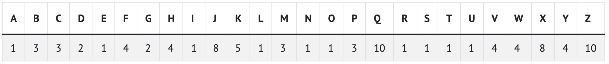

# Lab Challenge 5

> Arbeiten Sie alleine an den Challenges. Sie können sich mit ihrem Coach austauschen, aber arbeiten Sie nicht zusammen an der Challenge

## Was es zu tun gibt

1. Programmieren Sie **Scrabble**
1. Programmieren Sie **Readability**

## Scrabble

### Vorbereitung

TODO

### Specs

Finden Sie heraus, welcher Spieler beim Scrabble gewinnt:

~~~shell
$ ./scrabble
Spieler 1: COMPUTER
Spieler 2: science
Spieler 1 gewinnt!
~~~

Beim Spiel Scrabble spielen mehrere Spieler gegeneinander, mit dem Ziel Wörter aus Buchstaben mit einer möglichst hohen Punktzahl zu bilden. Die Punktzahl eines Worts ist dabei die Summe der Punktzahlen der einzelnen Buchstaben. Die Punktzahl der Buchstaben hängt wiederum von der Häufigkeit der Buchstaben ab: Häufigere Buchstaben geben weniger Punkte, seltenere Buchstaben mehr Punkte.

Die folgende Tabelle enthält die Punkte für alle Buchstaben des Alphabets:



Die Punktzahl für das Wort ```quiz``` ist beispielsweise ```22```, da ```q``` = 10, ```u```= 1, ```i``` = 1 und ```z``` = 10.

Implementieren Sie ```scrabble.py``` so, dass dieses Programm den Gewinner eines kurzen Scrabble-Spiels ermittelt. Bei diesem Spiel geben zwei Spieler jeweils ein Wort ein und das Programm gibt aus, wer gewonnen hat.

* In den Notes finden Sie eine Datenstruktur ```dictionary```, die Ihnen bei dieser Aufgabe helfen könnte. Ähnlich wie ein Telefonbuch kann dieses Dictionary die Werte für die einzelnen Buchstaben enthalten.
* Erstellen Sie einen Funktion ```computer_scrabble_score```, die als Parameter ein Wort erhält und den Score für das Wort zurückgibt. Zeichen die keine Buchstaben sind sind 0 Punkte wert und Klein- und Großbuchstaben haben die selbe Punktzahl. Beispielsweise zählt ein  ```!``` 0 Punkte und ```A``` und ```a``` sind beide einen Punkt Wert.
* Für diese Aufgabe müssen Sie nicht prüfen, ob das Wort auch tatsächlich existiert, d.h. in dieser Variante von Scrabble sind Phantasiewörter erlaubt.
*   In der ```main```-Funktion sollte Ihr Programm eine der folgenden Ausgaben erzeugen: ```Spieler 1 gewinnt!```, ```Spieler 2 gewinnt!``` oder ```Unentschieden!```.

Tipps:

* Die Funktionen ```upper()``` in Python kann Ihnen dabei helfen mit Klein- und Großbuchstaben umzugehen (vgl. die Notes dieser Challenge).

### Testen

Testen Sie Ihren Code wie folgt manuell:

```shell
$ python scrabble.py
Spieler 1: Frage?
Spieler 2: Frage!
Unentschieden!
```

~~~shell
$ python scrabble.py
Spieler 1: Oh?
Spieler 2: hey!
Spieler 2 gewinnt!
~~~

~~~shell
$ python scrabble.py
Spieler 1: Frage?
Spieler 2: Frage!
Unentschieden!
~~~

~~~shell
$ python scrabble.py
Spieler 1: Computer?
Spieler 2: Technologie!
Spieler 2 gewinnt!
~~~

~~~shell
$ python scrabble.py
Spieler 1: Skills
Spieler 2: Digital
Spieler 1 gewinnt!
~~~

Wenn alle manuellen Tests erfolgreich waren, können Sie Ihr Programm auch wie folgt automatisch auf der Console testen:

~~~shell 
test EXERCISE_NAME
~~~

Tipp: Der ```EXERCISE_NAME``` beginnt mit ```01-intro-``` und endet mit Ihrem GitHub Usernamen.

### Abgabe

Geben Sie Ihr Programm mit dem folgenden Befehl auf der Console ab:

~~~shell
submit EXERCISE_NAME
~~~

Hinweis: Sie können den obigen Befehl so oft ausführen wie Sie wollen. Bewertet wird immer der mit dem letzten Befehl hochgeladene Code.

## Readability

In dieser Aufgabe Implentieren Sie das Programm ```readability.py```, das die ungefähre Schwierigkeit eines Texts berechnet:

~~~shell
$ python readability.py 
Text: Congratulations! Today is your day. You're off to Great Places! You're off and away!
Level 3
~~~


### Vorbereitung

TODO

### Specs

Viele Kinderbücher haben eine Empfehlung, für welche Lese- bzw. Klassenstufe diese geeignet sind. Diese Stufe wird häufig durch einen Experten festgelegt. Aber auch Computer sind in der Lage die Schwierigkeit eines Texts automatisch zu berechnen.

Texte auf einem höheren Level (d.h. schwerer zu lesende Texte) haben meist längere Wörter und längere Sätze. Es existieren verschiedene Methoden, um das Level eines Texts zu berechnen, eine davon ist der *Coleman-Liau-Index*. Die Formel für diesen Index lautet wie folgt:

~~~ 
index = 0.0588 * L - 0.296 * S - 15.8
~~~

```L``` ist die durchschnittliche Anzahl von Buchstaben pro 100 Wörter, und ```S``` ist die durchschnittliche Anzahl von Sätzen pro 100 Wörter in einem Text. 

Das Programm ```readability``` soll wie folgt ablaufen:

~~~shell
$ ./readability
Text: Congratulations! Today is your day. You're off to Great Places! You're off and away!
Grade 3
~~~

Der eingegebene Text hat 65 Buchstaben, 4 Sätze und 14 Wörter. 65 Buchstaben pro 14 Wörter entspricht durchschnittlich 464,29 Buchstaben pro 100 Wörtern (```L = 65 / 14 * 100 = 464.29```). Und 4 Sätze pro 14 Wörter entspricht 28,57 Sätzen pro 100 Wörtern (```S = 4 / 14 * 100 = 28.57```). Setzt man die beiden Werte in die Formel zur Berechnung des *Coleman-Liau-Index* ein, ergibt sich ein Index von 3, da ```0.0588 * 464.29 - 0.296 * 28.57 - 15.8 = 3```.

Ein anderes Beispiel:

~~~shell
$ ./readability
Text: Harry Potter was a highly unusual boy in many ways. For one thing, he hated the summer holidays more than any other time of year. For another, he really wanted to do his homework, but was forced to do it in secret, in the dead of the night. And he also happened to be a wizard.
Grade 5
~~~

Dieser Text hat 214 Buchstaben, 4 Sätze und 56 Wörter. Dies entspricht ungefähr 382,14 Buchstaben pro 100 Wörtern und 7,14 Sätzen pro 100 Wörtern. In die Formel eingesetzt ergibt sich ein Index von 5.

Je höher der Durchschnitt von Buchstaben und Sätzen pro Wort, desto höher auch der *Coleman-Liau-Index*. 

Implementieren Sie ```readability.py```, um den *Coleman-Liau-Index* für verschiedene Texte zu berechnen:

* Das Programm muss die Nutzer auffordern einen Satz einzugeben, den Sie mit ```get_string``` einlesen können.
* Ihr Programm sollte die Anzahl von **Buchstaben**, **Wörtern** und Sätzen in dem eingelesenen Text zählen. Buchstaben können dabei groß oder klein geschrieben sein. Jede Zeichenkette, die durch ein Leerzeichen getrennt ist zählt als Wort. Das Ende eines Satzes wird durch jedes Vorkommen eines Kommas, Punkts oder Ausrufezeichens gekennzeichnet.
* Die Ausgabe Ihres Programms sollte ```Level X``` sein, wobei ```X``` dem Wert des *Coleman-Liau-Index*. für den eingegebenen Text entspricht. Runden Sie den Index auf die nächste Ganzzahl.
* Wenn der berechnete Index größer als 16 ist, soll das Programm ```Level 16+``` ausgeben, wenn der Index kleiner als 1 ist, soll das Programm ```Weniger als Level 1``` ausgeben.

#### Buchstaben zählen

Buchstaben sind einzelne Zeichen eines Satzes. In der Note zu dieser Challenge finden Sie den Beispielcode, um alle Zeichen eines Strings einzeln auszugeben. Dort finden Sie auch die Funktion upper, die jedes Zeichen in einen Großbuchstaben verwandelt. Eine Möglichkeit herauszufinden, ob ein Zeichen ein Buchstabe ist, ist zu prüfen, ob dieser in einer Liste von Buchstaben zu finden ist. Jedes Zeichen, das in dieser Liste ist, muss ein Buchstabe sein, alle anderen Zeichen sind keine Buchstaben. Auch für das Überprüfen, ob ein String in einer Liste von Strings enthalten ist, finden Sie ein Beispiel in der Note.

#### Wörter zählen

Die Note enthält ein Beispiel wie Sie eine Zeichenkette in ihre Einzelbestandteile zerlegen können. TODO

#### Sätze zählen

Überlegen Sie, wie Sie die Sätze zählen können. Gemäß der obigen Spezifikation bedeutet jedes Vorkommen eines Punkts, Kommas oder Ausrufezeichens einen eigenen Satz. Auch hier geben Ihnen die Notes einen entsprechenden Hinweis.

### Testen


Wenn alle manuellen Tests erfolgreich waren, können Sie Ihr Programm auch wie folgt automatisch auf der Console testen:

~~~shell 
test EXERCISE_NAME
~~~

Tipp: Der ```EXERCISE_NAME``` beginnt mit ```01-intro-``` und endet mit Ihrem GitHub Usernamen.

TODO: Wie kann man das besser erklären?!

### Abgabe

Geben Sie Ihr Programm mit dem folgenden Befehl auf der Console ab:

~~~shell
submit EXERCISE_NAME
~~~

Hinweis: Sie können den obigen Befehl so oft ausführen wie Sie wollen. Bewertet wird immer der mit dem letzten Befehl hochgeladene Code.
