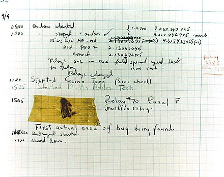
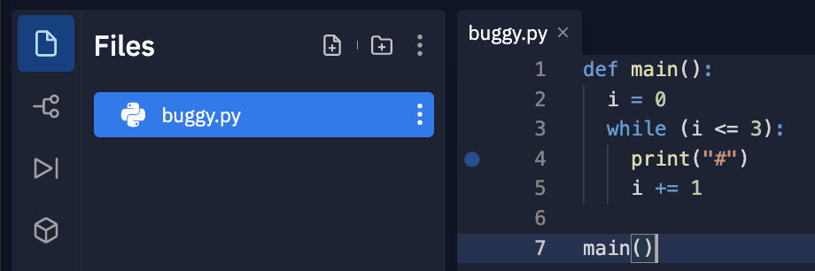
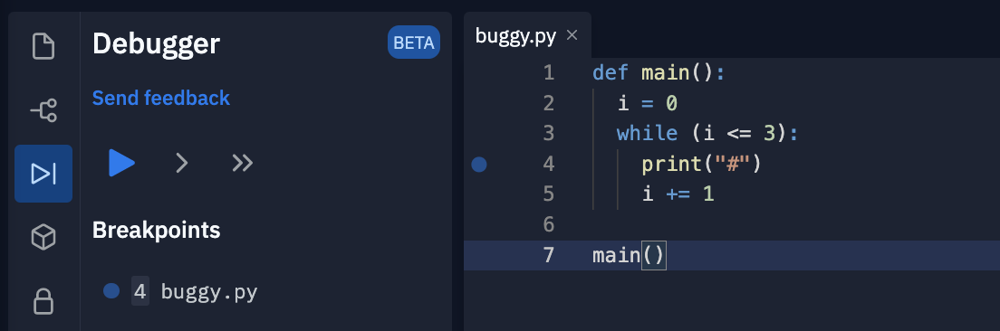

> Alle Codebeispiele für diese Challenge sind auf replit.com abrufbar:
> https://replit.com/@mheckner/Digital-Skills04Python2


# Debugging

**Bugs** sind Fehler in Programmen, die dazu führen, dass das Programm etwas anderes tut als von den Entwicklern vorgesehen. **Debugging** ist der Prozess diese Bugs zu finden und zu beheben.

Der Name Bug geht möglicherweise auf ein echtes Insekt zurück, das 1947 in dem Supercomputer Harvard Mark II gefunden wurde und das einen Fehler des Supercomputers verursachte (https://en.wikipedia.org/wiki/Harvard_Mark_II):



Das folgende Programm ist fehlerhaft (= buggy) und soll **drei** Blöcke (d.h. ```#```-Zeichen) ausgeben (```buggy.py```):

~~~python
def main():
  i = 0
  while (i <= 3):
    print("#")
    i += 1

main()
~~~

Das Programm lässt sich über die Shell ausführen, enthält aber einen logischen Fehler, da es 4 Blöcke ausgibt:

~~~shell
$ python3 buggy.py 
#
#
#
#
~~~

Möglicherweise wird der Fehler bereits deutlich, aber für das Debugging, lässt sich temporär eine weitere ```print```-Funktion in den Code integrieren:

~~~python
def main():
  i = 0
  while (i <= 3):
    print("#")
    i += 1
    print(f"i is: {i}")

main()
~~~

Die Ausgabe des Programms zeigt jetzt, dass ```i``` mit dem Wert 0 gestartet ist und der Wert erhöht wurde, bis ```i``` den Wert 4 angenommen hat:

~~~shell
$ python3 buggy.py 
#
i is: 1
#
i is: 2
#
i is: 3
#
i is: 4
~~~

Um den Wert 4 anzunehmen, muss die Schleife mit dem Startwert 3 für ```i``` begonnen haben. Dies ist ein Durchlauf zu viel. Ändert man die Bedingung von ```(i <= 3)``` auf ```(i < 3)``` funktioniert das Programm wie vorgesehen, und der Bug wurde identifiziert und behoben. 

Die vorgestellte Art Fehler durch ```print``` Anweisungen zu finden bezeichnet man in allen Programmiersprachen als **Printlining**. 

Zusätzlich bietet replit einen **Debugger**, d.h. ein Werkzeug das es erlaubt den Code während der Laufzeit Schritt für Schritt nachzuverfolgen und Variablen und andere Informationen anzusehen.

Zuerst klickt man dafür im Editor von replit in der vierten Zeile auf die Spalte links von den Zeilennnummern des Texteditors, sodass ein blauer Punkt erscheint:



Um den Debugger in replit aufzurufen, klickt man anschließend auf das Pfeilsymbol in der linken Seitenleiste von replit:



Der Debugger zeigt an, dass ein Breakpoint in ```buggy.py``` angelegt wurde.

Um den Programm mit dem Debugger auszuführen klickt man jetzt auf den blauen *Play-Button* (anstatt das Programm über die Shell zu starten). Das Programm bleibt anschließend am blauen Punkt (= **Breakpoint**) stehen, und erlaubt einen Blick in das Programm zur Laufzeit.

TODO: DEBUGGER IN REPLIT SCHEINT BUGGY - ANFRAGE GESTELLT:

https://replit.canny.io/general-feedback/p/debugger-feedback

TODO: DEBUGGER FERTIG inkl. step into

Eine weitere Möglichkeit, um Fehler in Programmen ist **Rubber-Duck-Debugging**. (https://en.wikipedia.org/wiki/Rubber_duck_debugging), bei dem man sich als Entwickler dazu zwingt den eigenen Code einem Quietscheentchen (oder einem anderen Objekt erklärt). Durch das laute Durchsprechen des eigenen Codes fallen einem häufig Fehler auf.

# Listen

Das folgende Beispiel berechnet den Durchschnitt aus drei Variablen (```score0.py```):

~~~python
def main():
  score1 = 72
  score2 = 73
  score3 = 33

  average = (score1 + score2 + score3) / 3
  print(f"Durchschnitt: {average}")

main()
~~~

Das Programm gibt den Durchschnitt korrekt aus, muss aber für jeden Wert der für die Berechnung des Durchschnitts verwendet werden soll eine neue Variable anlegen. Je mehr Werte in die Berechnung einfließen, desto unhandlicher und unübersichtlicher wird das Programm.

Python bietet zur Lösung dieses Problems den Datentyp ```list```, der es ermöglicht eine Sequenz von mehreren Werten nacheinander in einer einzigen Variable abzuspeichern.

Der Code ```scores = [72, 73, 33]``` erzeugt eine Liste aus drei Werten in Python. Auf diese Werte kann später beispielsweise mit ```scores[0]``` wieder zugegriffen werden (```score1.py```):

~~~python
def main():
  scores = [72, 73, 33]

  average = (scores[0] + scores[1] + scores[2]) / 3
  print(f"Durchschnitt: {average}")

main()
~~~

```scores[0]``` bezeichnet dabei das erste Element (Listen fangen bei ```0``` an zu zählen), während ```scores[2]``` sich auf das dritte Element (=```33```) bezieht.

In ```score2.py``` werden die Werte von den Nutzern eingelesen:

~~~python
from cs50 import get_int

def main():
  scores = []

  score1 = get_int("Score: ")
  score2 = get_int("Score: ")
  score3 = get_int("Score: ")

  scores.append(score1)
  scores.append(score2)
  scores.append(score3)
  
  average = (scores[0] + scores[1] + scores[2]) / 3
  print(f"Durchschnitt: {average}")

main()
~~~

Das Programm liest zunächst drei Werte ein und speichert diese in den Variablen ```score1```, ```score2```, und ```score3```. 

Die Liste ```scores``` ist in Python ein **Objekte** sind Variablen die einerseits mehr als einen Wert speichern können (die Liste speichert beispielsweise mehrere Werte) die andererseits auch Funktionen bieten, die nur zu diesen Variablen gehören. Eine solche Funktion ist ```append```, die als Parameter ein neues Element erwartet, das der Liste ```scores``` hinzugefügt werden soll. Funktionen die zu Objekten gehören müssen im Code per Punkt getrennt direkt hinter dem Objektnamen stehen (hier: ```scores0.append(score1)```).

Die Funktion ```append``` fügt der Liste ein neues Element hinzu und verlängert diese um jeweils dieses neue Element.

Das Design des obigen Programms ist suboptimal, da wieder für jeden neuen Wert eine neue Variable angelegt werden muss. Das Programm lässt sich wie folgt umschreiben (```score3.py```):

~~~python
from cs50 import get_int

NUM_SCORES = 3

def main():
  scores = []
  for i in range(NUM_SCORES):
    score = get_int("Score: ")
    scores.append(score)      

  average = (scores[0] + scores[1] + scores[2]) / NUM_SCORES
  print(f"Durchschnitt: {average}")

main()
~~~

Zu Beginn wird eine Konstante ```NUM_SCORE``` definiert, in der die Anzahl der Werte, die das Programm einlesen und in der Liste speichern soll abgelegt. Anschließend werden die Nutzer mit ```for i in range(NUM_SCORES):``` diesem Wert entsprechend oft (hier: 3) aufgefordert eine neue Zahl einzugeben, und diese Zahl wird der Liste ```scores``` hinzugefügt. Zur Berechnung des Durchschnitts wird ```NUM_SCORES``` dann erneut verwendet.

Das Design ist bei der Berechnung des Durchschnitts auf jedes Element der Liste einzelnn zugegriffen werden muss. Verändert sich der Wert von ```NUM_SCORES```, dann mus auch die Berechnung des Durchschnitts angepasst werden. 

Python bietet zur Lösung dieses Problems die Funktionen ```sum()``` und ```len()``` an (```score4.py```):

~~~python
from cs50 import get_int

NUM_SCORES = 3

def main():
  scores = []
  for i in range(NUM_SCORES):
    score = get_int("Score: ")
    scores.append(score)      

  average = sum(scores) / len(scores)
  print(f"Durchschnitt: {average}")

main()
~~~

```sum()``` berechnet die Summe aller Elemente der Liste, und ```len()``` zählt die Elemente der Liste. Das Design des Programms ist jetzt besser, da lediglich der Wert von ```NUM_SCORES``` an einer Stelle geändert werden muss und das Einlesen der Werte und die Berechnung passen sich automatisch an.

# Strings

Länge?

# Parameter von der Shell


Quelle: Angepasst und ergänzt von CS50, Harvard University, 2022 - https://cs50.harvard.edu/x/2022/
