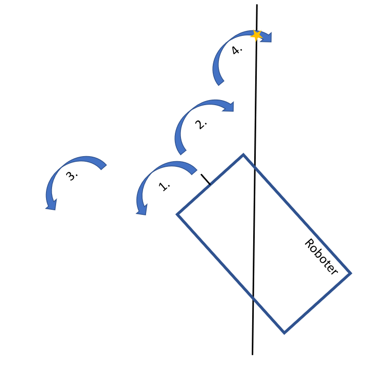

# Lab Challenge 6

> Arbeiten Sie alleine an den Challenges. Sie können sich mit ihrem Coach oder anderen Studierenden austauschen, aber arbeiten Sie nicht zusammen mit anderen Studierenden an einer Challenge und geben Sie auch nicht denselben Code ab.

## Was es zu tun gibt

1. Roboter einer Linie folgen lassen
2. Roboter den richtigen Pfad anhand der Farbkarten auswählen lassen
3. Roboter zum Ziel fahren lassen
4. Roboter den Ball liefern lassen
5. Optional: Zeiten für alle drei Strecken eintragen 
# TODO: Kann man da vielleicht in Tutors eine Tabelle einfügen in der die Studenten Ihre Zeiten pro Strecke eintragen könnnen?

## Ziel Challenge
Das Ziel dieser Challenge ist es einen (vereinfachten) Logistik-Roboter zu programmieren wie er bereits heutzutage in großen Logistikzentren im Einsatz ist. Befehle erhält der Roboter über die verschiedenen Farbkarten. Der Roboter soll dann die einzulagernde Ware (Ball) zu dem richtigen Lager fahren. 

In folgenden Video können Sie sehen wie der Roboter am Ende funktionieren soll.
TODO: Add better Video
https://www.youtube.com/shorts/lB5XeXfUrCc

## Roboter einer Linie folgen lassen

Nachdem im Kurs bereits gezeigt wurde wie der Roboter ein Quadrat fahren kann, soll nun als Erste Teilaufgabe der Roboter der schwarzen Linie folgen können. 
Hier als kleine Hilfestellung ein Codeauschnitt durch den der Roboter sich auf der Stelle drehen kann:

~~~
motor_pair = MotorPair('A', 'B')

# Dreht den Robotor nach links
def turn_left(distance):
    motor_pair.move_tank(distance, 'cm', left_speed=-30, right_speed=30)
~~~

Gerne können Sie mit der Drehgeschwindigkeit (hier 30) etwas herum experimentieren. Legen Sie analog zu der Methode eine turn_right - Methode an.
Damit der Roboter der Linie folgen kann muss er sich darauf ausrichten können sollte er davon abkommen. Die Linie erkennt der Roboter mithilfe eines Farbsensors der auf den Boden ausgerichtet ist. 
Hier sind alle wichtigen Methoden des Farbsensors zusammengefasst:

~~~
color_sensor = ColorSensor('E')

# Wartet auf eine Farbänderung
color = color_sensor.wait_for_new_color()

# Gibt die aktuelle Farbe unter dem Sensor zurück
color = color_sensor.get_color()
~~~

Der einfachste Lösungsansatz, den Roboter richtig auszurichten, wäre es ihn in eine vorher definierte Richtung stückchenweise zu drehen und nach jeder Drehung zu überprüfen ob er auf der Linie steht. Sobald er mit dem Farbsensor erkennt das er auf der schwarzen Line steht wird die Methode abgebrochen und der Roboter ist erfolgreich ausgerichtet. Allerdings ist dieser Lösungsansatz sehr langsam, da man vorher nicht weis in welche Richtung die Linie liegt. 
Ist der Roboter beispielsweise um 5° zu weit nach links gedreht wäre es intuitiv sehr einfach zu erkennen das man den Roboter nur um 5° nach rechts drehen muss um ihn korrekt auszurichten. Der Farbsensor erkennt allerdings nur die Farbe direkt unter dem Roboter, hätte man also eine Linksdrehung als Standard definiert müsste sich der Roboter um 355° drehen um sich korrekt auszurichten.

Um den Roboter die verschiedenen Strecken performanter fahren zu lassen wählen wir einen etwas komplexeren Algorithmus. Die Kernidee dahinter ist den Roboter wie ein (physikalisch fragwürdiges) Pendel immer weiter nach Links und Rechts schwenken zu lassen. Folgende Grafik soll den Algorithmus veranschaulichen. Jeder der Pfeile besteht aus einer definierten Anzahl an stückweise Drehungen. Nach jeder Stückweisen Drehung wird überprüft ob der Roboter korrekt steht. Um zum Ausgangspunkt des nächsten Pfeils zu kommen wird der Roboter in einem Stück gedreht (ohne die stückweise Unterteilung).  

Ihre Aufgabe wird sein in folgenden Codeauschnitt die "search_gradually"-Methode fertig zu implementieren, welche schrittweise den Roboter dreht, sowie die "line_found"-Methode. Beginnen Sie am besten mit der "line_found", da Sie diese in der "search_gradually" benötigen werden.

> Tipp für die "search_gradually"-Methode: Der Parameter "turn_direction_method" kann entweder den Wert "turn_left" oder "turn_right", enthalten. Also die Methodennamen der vorher implementierten Methoden.
Verwendung: 

~~~
# Dreht je nach Wert des Parameters "turn_direction_method" den Roboter um den Wert xy nach Links oder Rechts.
turn_direction_method(xy)
~~~
  
> Erklärung der Konstanten:
> TURN_DISTANCE_STEP: Gibt die Entfernung der Stückweisen Drehungen an, sollte sich der Roboter über die Linie drehen muss dieser Wert verkleinert werden, je größer er ist umso schneller findet der Roboter die Linie.
>  AMPLITUDE_STEP: Gibt die Länge eines "Pfeils" an, heißt wie oft dreht sich der Roboter bevor er in der anderen Richtung sucht.

~~~
## Konstanten
# legt die Schrittweite der Drehung beim suchen fest, nuss so festgelegt werden, dass Roboter sich nie beim suchen über die Linie dreht
TURN_DISTANCE_STEP = 1
# Faktor legt fest wie oft links/rechts gesucht wird
AMPLITUDE_STEP = 3 * TURN_DISTANCE_STEP

# Überprüft ob der Roboter auf einer schwarzen Linie steht
def line_found(color):
    # TODO: Überprüfen ob die color Variable schwarz ist

# Richtet den Roboter wieder zur schwarzen Linie aus
def find_line():
    turn_distance = AMPLITUDE_STEP
    while not line_found(color_sensor.get_color()):
        detected_line = search_gradually(turn_left)
        if not detected_line:
            turn_right(turn_distance)
            detected_line = search_gradually(turn_right)
            if not detected_line:
                turn_distance += AMPLITUDE_STEP
                turn_left(turn_distance)
                turn_distance += AMPLITUDE_STEP
        else:
            return
    return
    
# Dreht den Robotor Schrittweise in die Richtung der turn_direction_method, bis die Linie gefunden wurde
## turn_direction_method: Funktionsname einer Funktion die als Parameter eine Zahl erwartet, welche die Entfernung angibt
## returns: True, sobald der Roboter auf der Linie steht, False falls die Linie nicht gefunden wurde
def search_gradually(turn_direction_method):
    cur_distance = 0.0
    # TODO: Sie müssen die Methode noch fertig programmieren, die Kommentare sollen Ihnen als Hilfestellung dienen
    # Überprüfe solange die aktuelle Drehung kleiner gleich AMPLITUDE_STEP ist
    
    # Drehe mit der "turn_direction_method"-Methode um TURN_DISTANCE_STEP
        
    # Überprüfe ob unter Sensor die Linie liegt, ggf. Methode abbrechen
~~~

Sobald Sie alles korrekt implementiert haben und Sie die "find_line()"-Methode aufrufen, dreht sich der Roboter so lange auf der Stelle bis er auf die schwarze Linie ausgerichtet ist und bleibt genau mit dem Sensor darauf stehen. 
Nun können Sie in einer Schleife den Roboter immer ein Stück geradeaus fahren lassen und dann überprüfen ob er noch immer auf der schwarzen Linie steht. (Finden Sie selbst durch probieren heraus was eine gute Entfernung zum geradeaus fahren ist, sodass der Roboter nicht allzu weit beim Linie suchen korrigieren muss. Am besten fahren Sie mit dem Farbsensor voraus, da so das Steuern erheblich leichter wird.)

## Roboter den richtigen Pfad anhand der Farbkarten auswählen lassen

Um den Roboter Befehle zu erteilen wollen wir nun die Farbkarten und den Farbsensor nutzen. Der Roboter soll in seiner Ausgangsposition in dem Kreis in der Ecke der Matte stehen und solange warten bis er durch eine Farbkarte unter dem Sensor einen Befehl erhalten hat. Anschließend wollen wir den Roboter so lange drehen, bis er die richtige Ausrichtung hat und dann der Linie folgen lassen.

> Kleiner Tipp: Um diese Teilaufgabe zu implementieren benötigen Sie folgende Befehle. Außerdem sollten Sie sobald die richtige Farbe gefunden wurde erst ein kleines Stück gerade aus fahren, da ansonsten der Roboter sich auf der Stelle dreht und versucht die schwarze Linie zu finden. 

~~~
color_sensor = ColorSensor('E')

card_color = color_sensor.wait_for_new_color()
~~~

## Roboter zum Ziel fahren lassen

Für diese Aufgabe ist etwas kreativeres Programmieren notwendig. Da bisher der Roboter am Ende der Linie nur anfängt nach der schwarzen Linie zu suchen muss unser bisheriger Code erweitert werden um zu erkennen das wir das Ziel erreicht haben. 
Speichern Sie sich dazu am Anfang die Farbe der Karte in einer Variable und überprüfen sie während Sie der Linie folgen immer wieder ob das Ziel erreicht wurde. (Vergessen Sie nicht das am Ende auch beim Linie suchen es möglich ist das Ziel zu erreichen.)
Dazu ist es notwendig die Farbe der Karte an verschiedene Methoden als zusätzlichen Parameter zu übergeben. Arbeiten Sie nicht mit einer globalen Variable!

Wurde das Ziel erreicht drehen Sie den Roboter um 180° um später den Ball ablegen zu können.

> Tipp: Je nachdem wie Ihre Logik aufgebaut ist, kann es sein das der Roboter denkt er ist bereits am Ziel wenn Sie die Karte zu lange unter dem Sensor halten. Vielleicht kann Ihnen folgender Befehl helfen um mit dem Programm zu warten bis die Karte heraus gezogen wurde.

~~~
wait_until(xy, not_equal_to, yx)
~~~

## Roboter den Ball liefern lassen

Damit unser Lieferroboter auch wirklich etwas transportieren und abgeben kann wollen wir nun noch den Roboterarm nutzen. Ziel ist es am Anfang nach Erhalt des Befehls den Roboterarm auf den Boden abzusenken und zu warten bis der Ball hinein gelegt wurde. Anschließend wird der Arm etwas angehoben, sodass er nicht am Boden schleift und der Ball leicht heraus rollen kann. Sobald der Roboter sein Ziel erreicht hat und sich gedreht hat wird der Arm wieder abgesenkt und der Roboter fährt ein Stück weg um den Ball am Zielort abzulegen.

> Tipp: Der Abstandsensor wurde so am Roboter angebracht das er genutzt werden kann um den Ball zu erkennen

> Tipp: Nutzen Sie die Matrix und oder Töne um die einzelnen Schritte zu erkennen (Karte erkannt, Ball erkannt,....)

> Folgende Werte können bei Ihnen abweichen, abhängig davon in welcher Ausgangsposition die Motoren waren als Sie zusammengebaut wurden. Heben Sie den Roboter an und experimentieren Sie mit den Werten um den Arm genau auf den Boden abzusenken, bzw. soweit anzuheben das der Ball etwas über dem Boden ist.

~~~
# Arm ablegen
def put_arm_down():
    roboter_arm.run_to_position(30, 'counterclockwise', 10)

# Arm anheben
def put_arm_up():
    roboter_arm.run_to_position(70, 'clockwise', 5)
~~~

## Optional: Zeiten für alle drei Strecken eintragen 

# TODO:
Um den schnellsten Roboter ausfindig zu machen stoppen Sie die Dauer die Ihr Roboter für alle drei Strecken benötigt und tragen Sie die Werte hier ein: https://....

