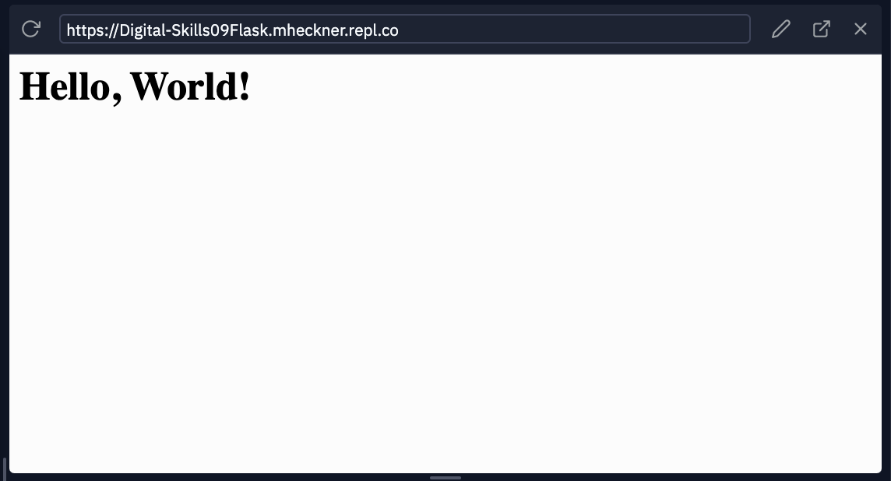
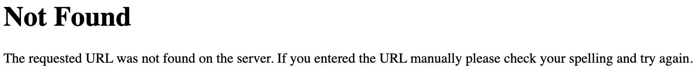
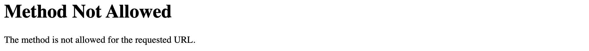
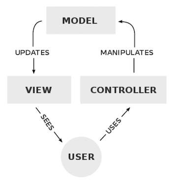
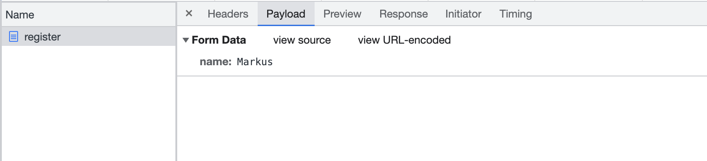
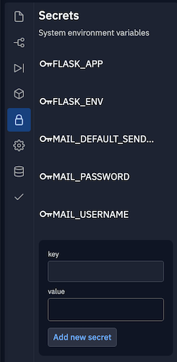
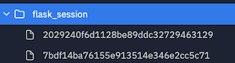

> Alle Codebeispiele für diese Challenge sind auf replit.com abrufbar:
> https://replit.com/@mheckner/Digital-Skills09Flask

# Webentwicklung

In dieser Woche werden die bisherigen Technologien (d.h. Python und Datenbanken) dazu verwendet um Applikationen für das Web zu entwickeln.

In der letzten Woche wurde in replit ein ```http-server``` verwendet. Dieses Programm lauscht auf eigehende Anfragen (requests) und antwortet mit statischen Inhalten wie HTML-Dateien und Bildern. Aber der ```http-server``` kann keine anderen Anfragen wie beispielsweise Formulareingaben von den Nutzern verarbeiten.

Eine URL kann wie folgt aussehen:

~~~
http://www.example.com
~~~

fragt die Standardseite einer Site an.

~~~
http://www.example.com/file.html
~~~

fragt eine spezifische Datei an.

Eine Datei kann sich auch in einem Ordner befinden:

~~~
http://www.example.com/folder/file.html
~~~

Den Teil ```/folder/file.html``` nennt man einen **Pfad** oder eine **Route**. 

Eine URL kann auch Parameter aus einem Formular enthalten:

~~~
http://www.example.com/route?key=value
~~~

Eine HTTP Anfrage an eine Route mit Eingaben der Nutzer aus einem Formular kann wie folgt aussehen:

~~~
GET /search?q=cats HTTP/1.1
HOST: www.google.com
...
~~~

Für eine solche Anfrage wird ein Webserver benötigt, der solche HTTP-request-header *parsen*, d.h. analysieren kann und in Abhängigkeit der Route und der Parameter unterschiedliche Seiten ausliefern kann.

# Flask

Wir verwenden Python und die Bibliothek Flask, um einen eigenen Webserver zu erstellen.

Flask ist ein **Framework**, d.h. neben der Code-Bibliothek liefert Flask auch eine Reihe von Konventionen, wie die Bibliothek zu benutzen ist. Beispielsweise enthält Flask Funktionen die verwendet werden können, um HTTP-requests zu parsen. Zusätzlich aber erwartet Flask, dass die Webapplikation wie folgt strukturiert ist: 

```
app.py
static/
templates/
```

* `app.py` enthält den Python Code für den Server
* `static/` ist ein Verzeichnis statischer Dateien wie Bilder, CSS und JavaScript
* `templates/` ist ein Verzeichnis, das HTML-Dateien als Vorlagen für die Seiten des Webservers enthält.

Andere Frameworks für Webserver verwenden andere Konventionen.

Der folgende Code in der Datei `app.py`im Ordner `01_hello_flask` ist ein einfacher Webserver.

~~~python
from flask import Flask, render_template, request

app = Flask(__name__)

@app.route("/")
def index():
    return render_template("index.html")
~~~

* Zuerst wird ```Flask``` (und ein paar weitere Funktionen) aus der Bibliothek ```flask``` importiert
* Anschließend wird eine Variable ```app``` erstellt, indem der Funktion ```Flask``` der Name der Python Datei (```__name__``` entspricht ```app.py```) übergeben wird
* Anschließend erstellen wir eine Funktion ```@app.route```  für die Route ```/```. Das ```@``` Zeichen ist ein **decorator** , der eine Funktion mit zusätzlichen Features austtattet (TODO)
* Die Funktion ```index()``` *rendert* (später) das Template ```index.html``` oder schickt direkt (jetzt) eine HTML-Antwort an den Client zurück

Die Datei ```index.html``` befindet sich im Ordner ```templates/``` und sieht wie folgt aus:

~~~html
<!DOCTYPE html>

<html lang="en">
    <head>
        <meta name="viewport" content="initial-scale=1, width=device-width">
        <title>hello</title>
    </head>
    <body>
        hello, world
    </body>
</html>
~~~

Das folgende Kommando in der Shell von replit startet den Webserver:

 ```console
 flask run --host=0.0.0.0
 ```

In replit öffnet sich anschließend eine Browservorschau und zeigt eine Seite wie die folgende an (die URL ist je nach replit-Account unterschiedlich):



Durch Klick auf das Icon


öffnet sich die Seite in einem neuem Browser-Tab.

Wenn man jetzt die URL anpasst, indem man ```/?name=Skywalker``` hinzufügt, öffnet sich die Seite weiterhin, aber der Inhalt bleibt gleich.

Um Skywalker persönlich zu begrüßen muss der Code in ```app.py``` wie folgt angepasst werden:

~~~python
from flask import Flask, render_template, request

app = Flask(__name__)

@app.route("/")
def index():
    name = request.args.get("name")
    return render_template("index.html", name=name)
~~~

Die Variable ```request``` aus der Flask-Bibliothek enthält die Argumente aus der URL der Anfrage an den Webserver. Im Anschluss wird die Variable ```name``` als Parameter an die Funktion ```render_template``` übergeben.

In der HTML Datei kann diese Variable mit zwei geschweiften Klammern ausgelesen werden:

~~~html
<!DOCTYPE html>

<html lang="en">
    <head>
        <meta name="viewport" content="initial-scale=1, width=device-width">
        <title>hello</title>
    </head>
    <body>
        hello, {{ name }}
    </body>
</html>
~~~

Wird die Seite jetzt mit dem Zusatz ```/?name=Skywalker``` in der URL aufgerufen, wird Skywalker korrekt begrüßt.

Um sicherzustellen, dass das Template neu geladen wird, den Server auf der Kommandozeile durch gleichzeitiges Drücken der Tasten ```Strg``` und ```C``` stoppen (Mac: ```control```  und ```C```) und mit den folgenden Befehl neu starten:

 ```console
 flask run --host=0.0.0.0
 ```

# Formulare

Ergänzen von ```index.html```um ein Formular:

~~~html
<!DOCTYPE html>

<html lang="en">
    <head>
        <meta name="viewport" content="initial-scale=1, width=device-width">
        <title>hello</title>
    </head>
    <body>
        <form action="/greet" method="get">
            <input autocomplete="off" autofocus name="name" placeholder="Name" type="text">
            <input type="submit" value="Send">
        </form>
    </body>
</html>
~~~

Das Formular wird an die Route ```greet``` gesendet und verfügt über eine Eingabemöglichkeit für den Namen (```name```) und einen Button, um das Formular abzusenden (```<input type="submit" value="Send">```).

Nach Neustart des Servers und Klick auf den Button enthält die URL zwar die Daten aus dem Formular (```/greet?name=Skywalker```), aber die Webseite zeigt einen Fehler:



```app.py``` muss um eine Funktion, analog zur ```index```-Funktion ergänzt werden, um die Anfrage an die Route ```/greet``` verarbeiten zu können:

~~~python
from flask import Flask, render_template, request

app = Flask(__name__)

@app.route("/")
def index():
    return render_template("index.html")

@app.route("/greet")
def greet():
  name = request.args.get("name")
  return render_template("greet.html", name=name)
~~~

Die ```index()``` Funktion gibt jetzt nur noch das Formular an den Client zurück.

Wenn das Formular jetzt abgeschickt wird erhält der Nutzer den folgenden Fehler:


Auch die Shell in replit zeigt eine Fehlermeldung:

~~~
...
File "/opt/virtualenvs/python3/lib/python3.8/site-packages/flask/templating.py", line 95, in _get_source_fast
    raise TemplateNotFound(template)
jinja2.exceptions.TemplateNotFound: greet.html
~~~

Gemäß der Fehlermeldungen ging der request an die korrekte Route, aber Flask konnte das Template ```greet.html```nicht finden.

Um den Fehler zu beheben muss ein neues Template ```greet.html```im Ordner ```templates```angelegt werden, das wie zuvor die Variable ```name```ausliest:

~~~html
<!DOCTYPE html>

<html lang="en">
    <head>
        <meta name="viewport" content="initial-scale=1, width=device-width">
        <title>hello</title>
    </head>
    <body>
        hello, {{ name }}
    </body>
</html>

~~~

Nach Neustart des Servers wird das Formular auf der Startseite angezeigt und übermittelt den Inhalt des Formulars beim Absenden an den Server, der dann eine zweite Seite mit dem neuen Template generiert.

Die Funktion ```get()``` unterstützt einen default-Wert, falls ```name``` keinen Wert enthält (d.h. falls das Formular beispielsweise leer abgeschickt wurde). Dementsprechend lässt ```greet()```  sich wie folgt umschreiben:

~~~python
@app.route("/greet")
def greet():
  name = request.args.get("name", "world")
  return render_template("greet.html", name=name)
~~~

Wird die Route ```/greet``` jetzt direkt im Browser (d.h. ohne das Formular) aufgerufen, wird die Variable ```name```defaultmäßig auf den Wert ```world``` gesetzt und *hello, world* erscheint im Browser.

Wenn aber das Formular leer abgeschickt wird, wird die URL ```/greet?name=``` aufgerufen und ```name``` ist ein leerer String. Das Formulareingabefeld kann um das Attribut ```required``` ergänzt werden, um dies zu vermeiden. Da Seiten aber mit den Chrome Developer-Tools clientseitig manipuliert werden können, kann man sich auf dieses Attribut nicht alleine verlassen.

# Layouts

Der Code in ```index.html``` und ```greet.html``` enthält einige Wiederholungen (hier den gesamten ```<head>``` der beiden HTML-Dateien). Mit HTML alleine lässt sich der Code nicht zwischen den HTML-Dateien *sharen*, aber Flask Templates (und andere Web Frameworks) bieten Möglichkeiten, um gleiche Codebestandteile auszulagern.

Dazu wird ein neues Template ```layout.html```erstellt:

~~~html
<!DOCTYPE html>

<html lang="en">
    <head>
        <meta name="viewport" content="initial-scale=1, width=device-width">
        <title>hello</title>
    </head>
    <body>
       
    </body>
</html>
~~~

Mithilfe der Syntax `````` lassen sich Platzhalter oder andere Codebestandteile in Templates integrieren. Der Block wird als ```body``` bezeichnet, da dort das HTML für den ```<body>``` der HTML eingefügt werden soll.

Jetzt kann ```index.html``` so angepasst werden, dass das Gerüst aus ```layout.html``` verwendet wird und nur noch die Bestandteile aus ```body```-Blocks ergänzt werden:

~~~html



  <form action="/greet" method="get">
      <input autocomplete="off" autofocus name="name" placeholder="Name" type="text">
      <input type="submit" value="Send">
  </form>

~~~

Der Block `````` teilt Flask mit, dass ```index.html```  ein anderes Template (```layout.html```) benötigt und den Code des Platzhalters ```{block body)``` durch das Formular ersetzt.

Somit wurde enthält die Datei ```index.html```  nur noch das Formular und der *duplicate code* aus entfernt und in das Template ausgelagert.

Das Template ```greet.html``` kann analog angepasst werden:

~~~html



  hello, {{ name }}

~~~

Die Sprache zur Erstellung der Templates heißt Jinja und wird von Flask unterstützt. Andere Frameworks arbeiten nach einem ähnlichen Mechanismus, auch wenn sich die Syntax unterscheidet.

Nach Neustart des Server erhält der Client nach einer Anfrage der Startseite des Servers eine vollständige HTML-Datei:

~~~html
<!DOCTYPE html>

<html lang="en">
    <head>
        <meta name="viewport" content="initial-scale=1, width=device-width">
        <title>hello</title>
    </head>
    <body>
       
  <form action="/greet" method="get">
      <input autocomplete="off" autofocus name="name" placeholder="Name" type="text">
      <input type="submit" value="Send">
  </form>

    </body>
</html>
~~~

Die Einrückung des automatisch generierten Codes passt nicht mehr, das ist aber nicht wichtig, da die Einrückung in den Templates korrekt ist und somit der Sourcecode korrekt eingerückt ist.

# POST

Die obige Form verwendet die http-Methode ```GET```, um die Anfrage an den Server zu senden, d.h. die Formulardaten sind Teil der URL (z.B. ```/?name=Skywalker```). Sollen die Daten nicht in der URL sichtbar sein, sondern als Teil der Anfrage gesendet werden, muss nur die Methode im Formular von ```GET``` auf ```POST``` geändert werden:

~~~~
<form action="/greet" method="post">
~~~~

Schickt man jetzt das Formular ab, erscheint die folgende Fehlermeldung:



Die Route in Flask muss ebenfalls angepasst werden, über Anfragen über die Methode ```POST``` verarbeiten zu können:

~~~python
@app.route("/greet", methods=["POST"])
def greet():
  name = request.form.get("name", "world")
  return render_template("greet.html", name=name)
~~~

```request.args``` enthält Daten von ```GET``` Anfragen, ```request.form.get``` enthält Daten von ```POST```-Anfragen 

Ruft man jetzt nach einem Neustart des Servers die Startseite auf und schickt das Formular ab, sind die Daten aus dem Formular aus der URL verschwunden und die Nutzer sehen nur die URL ```/greet```.

Lädt man die ```/greet```-Seite neu, merkt sich der Browser die letzte Anfrage und fragt, ob die Daten per ```POST```erneut übermittelt werden sollen.

```GET``` requests sind hilfreich, weil der Browser die Inhalte des Formulars in der Browser-History abspeichern kann und Links inkl. zusätzlichen Informationen übergeben werden können, wie die folgende Google-Suche:

~~~
https://www.google.com/search?q=google+current+time
~~~

# Model View Controller (MVC)

Das Framework Flask implementiert mit **Model-View-Controller** ein bestimmtes *Entwurfsmuster*, bzw. eine bestimmte Programmierphilosophie:



Der **Controller** enthält die *Business-Logik*, d.h. den Code der den Input der User entgegennimmt und die Applikation steuert. Dieser Code steht in Flask in der Datei ```app.py```. Der **View** enthält die Templates und die  Darstellung des User Interfaces, d.h. den HTML- und CSS-Code. Das **Model** beinhaltet die Daten der Applikation, z.B. in Form einer SQL-Datenbank oder eines CSV-Files (die Beispiele bisher haben noch kein Model).

Das **Model-View-Controller** ist ein allgemeines *Entwurfsmuster*, das von vielen (Web-)Applikationen implementiert wird.

# OTH-Sport

In diesem Kapitel wird eine Web-App vorgestellt, mit der sich Studierende der OTH für gemeinsame Sportaktivitäten registrieren können.

Die Datei ```layout.html``` ist ähnlich wie zuvor:

~~~html
<!DOCTYPE html>

<html lang="en">
    <head>
        <meta name="viewport" content="initial-scale=1, width=device-width">
        <title>OTH-Sport</title>
    </head>
    <body>
       
    </body>
</html>

~~~

In ```app.py``` das Template ```index.html``` bei Anfragen an die Standardroute ```/``` zurückgegeben:

~~~~python
from flask import Flask, render_template, request

app = Flask(__name__)

@app.route("/")
def index():
    return render_template("index.html")
~~~~

Das Template ```index.html``` sieht wie folgt aus:

~~~python



  TODO

~~~

Wird der Server mit ```flask run --host=0.0.0.0``` gestartet, erscheint Todo im Browser.

Damit Studierende sich für eine bestimmte Sportart registrieren können wird ```index.html``` um ein Formular ergänzt:

~~~python



  <h1>Für Sport registrieren</h1>
    <form action="/register" method="post">
        <input autocomplete="off" autofocus name="name" placeholder="Name" type="text">
        <select name="sport">
            <option disabled selected>Sport</option>
            <option value="Frisbee">Frisbee</option>
            <option value="Fussball">Fussball</option>
            <option value="Spikeball">Spikeball</option>
        </select>
        <input type="submit" value="Registrieren">
    </form>

~~~

Das Formular übermittelt den Namen des Studierenden und die gewünschte Sportart per POST an die Route ```/register```. Damit diese Angaben korrekt verarbeitet werden können, muss ```app.py``` wie folgt angepasst werden:

~~~python
@app.route("/register", methods=["POST"])
def register():

    # Validate submission
    if not request.form.get("name") or request.form.get("sport") not in ["Frisbee", "Fußball", "Spikeball"]:
        return render_template("failure.html")

    # Confirm registration
    return render_template("success.html")
~~~

Die Route ```/register``` erlaubt die Methode POST und prüft, ob der Name und eine korrekte Sportart im request übermittelt wurden. Falls nicht, wird ein Fehlertemplate (```failure.html```) zurückgeben, falls die Angaben korrekt übermittelt wurden, wird das Template ```success.html``` zurückgegeben.

 ```failure.html``` sieht wie folgt aus:

~~~html



    Fehler: Du bist nicht registriert!

~~~

```sucess.html``` sieht wie folgt aus:

~~~html



   	Du bist registriert!

~~~

Achtung: Die Web-App zeigt zwar eine Erfolgsseite an, speichert die übermittelten Daten bisher noch nicht ab!

Testet man jetzt (nach einem Start des Flask Servers) die Seite im Browser, wird die Erfolgsseite aber nicht angezeigt (sondern immer das Fehler-Template), obwohl das Formular ausgefüllt wurde.

Wenn man in Chrome die Developer-Tools öffnet und das Formular erneut abschickt, fällt auf, dass unter *Form-Data* nur der Name (```name: Markus```) aus dem Formular, nicht aber die Sportart übermittelt wird:



Um die Sportart ebenfalls an den Server zu senden, benötigt das ```<select>``` Eingabefeld aus dem Formular ein Attribut ```name```:

~~~html



  <h1>Für Sport registrieren</h1>
    <form action="/register" method="post">
        <input autocomplete="off" autofocus name="name" placeholder="Name" type="text">
        <select name="sport">
            <option disabled selected>Sport</option>
            <option value="Frisbee">Frisbee</option>
            <option value="Fussball">Fussball</option>
            <option value="Spikeball">Spikeball</option>
        </select>
        <input type="submit" value="Registrieren">
    </form>

~~~

Jetzt kann der Server die Sportart mit ```request.form.get("sport")``` auslesen, und die Erfolgsseite wird angezeigt.

Um die Seite optisch ansprechender zu gestalten, kann ```layout.html``` auch auf eine CSS-Datei verlinken:

~~~ html
<!DOCTYPE html>

<html lang="en">
    <head>
        <meta name="viewport" content="initial-scale=1, width=device-width">
        <link href="/static/styles.css" rel="stylesheet">
        <title>OTH-Sport</title>
    </head>
    <body>
       
    </body>
</html>
~~~

Die CSS-Datei muss im Ordner ```/static``` erstellt werden:

~~~css
body {
  background: cornflowerblue;
}
~~~

Um den Code der Web-App besser zu strukturieren (hier: die Logik aus dem **Controller** vom **View** zu trennen), lässt sich eine Liste von Sportarten in ```app.py``` erstellen:

~~~python
from flask import Flask, render_template, request

app = Flask(__name__)

SPORTS = [
  "Frisbee",
  "Fussball",
  "Spikeball"
]

@app.route("/")
def index():
    return render_template("index.html", sports=SPORTS)
...
~~~

Diese Liste der Methode ```render_template``` übergeben, und kann im Template mit einer Schleife dazu verwendet werden das Formular dynamisch zu generieren:

~~~python
...

		<option value="{{ sport }}">{{ sport }}</option>

...
~~~

Mithilfe von ```for``` und ```endfor``` wird eine Schleife erzeugt, welche die ```<option>```-Elemente mit den Inhalten aus der Liste ```sports``` erstellt. 

Da jetzt die Liste der Sportarten zentral in ```app.py``` gespeichert ist, kann diese auch dafür verwendet werden, um in der Route ```/register``` zu überprüfen, ob die über das Formular gesendete Sportart auch in der Liste der zulässigen Sportarten (```SPORTS```) enthalten ist:

~~~python
...
@app.route("/register", methods=["POST"])
def register():
  
    if not request.form.get("name") or request.form.get("sport") not in SPORTS:
        return render_template("failure.html")

    return render_template("success.html")
...
~~~

Neben der Trennung von **Controller** und **View** hat sich auch die Wartbarkeit der Web-App verbessert: Soll jetzt eine neue Sportart hinzugefügt werden, reicht es diese in der Liste ```SPORTS``` zu ergänzen. Der Rest funktioniert automatisch.

Sollen Sie Studierende auch für mehrere Sportarten anmelden können, kann man das Formular auf *Checkboxen* wie folgt umbauen:

~~~html



  <h1>Für Sport registrieren</h1>
    <form action="/register" method="post">
        <input autocomplete="off" autofocus name="name" placeholder="Name" type="text">
        
          <input name="sport" type="checkbox" value="{{ sport }}"> {{ sport }}
        
        <input type="submit" value="Registrieren">
    </form>

~~~

Jedes Element ```<input>``` benötigt das Attribut ```name=sport```, damit die Sportart per POST an den Server übermittelt wird. Zusätzlich steht der ```sport``` noch hinter dem ```<input>```-Element, damit die Studierenden sehen können, welche Sportart sie auswählen.

Sollen sich die Studierenden nur für eine Sportart registrieren können, lässt sich der Typ des ```<input```-Elements von ```checkbox``` auf ```radio``` umstellen:

``` <input name="sport" type="radio" value="{{ sport }}"> {{ sport }}```

# Daten speichern

Damit sich Studierende auch wirklich anmelden können, müssen die Daten auf dem Server gespeichert werden.

Dazu kann in ```app.py``` ein ```dictionary``` ergänzt werden, das die Registrierungen im Arbeitsspeicher des Webservers ablegt (Codebeispiel aus ```oth_sport_6```):

~~~python
from flask import Flask, redirect, render_template, request

app = Flask(__name__)

REGISTRANTS = {}

SPORTS = [
  "Frisbee",
  "Fussball",
  "Volleyball",
  "Spikeball",
]

@app.route("/")
def index():
    return render_template("index.html", sports=SPORTS)

@app.route("/register", methods=["POST"])
def register():

    # Validate name
    name = request.form.get("name")
    if not name:
        return render_template("error.html", message="Name fehlt")

    # Validate sport
    sport = request.form.get("sport")
    if not sport:
        return render_template("error.html", message="Sportart fehlt")
    if sport not in SPORTS:
        return render_template("error.html", message="Ungültige Sportart")

    # Remember registrant
    REGISTRANTS[name] = sport

    # Confirm registration
    return redirect("/registrants")


@app.route("/registrants")
def registrants():
    return render_template("registrants.html", registrants=REGISTRANTS)
~~~

 Das Dictionary ```REGISTRANTS``` wird angelegt, um dort die Registierungen der Studierenden für die unterschiedlichen Sportarten abzuspeichern.

Zuerst wird in ```register``` überprüft, ob ```name``` und ```sport``` korrekt an den Webserver übermittelt wurde und anschließend eine entsprechende Fehlermeldung mithilfe des Templates ```error.html``` ausgegeben. Anschließend werden ```name``` und ```sport``` in ```REGISTRANTS``` abgespeichert und der Nutzer wird auf eine weitere Route ```/registrants``` weitergeleitet, auf der die Registrierungen angezeigt werden. 

Das Template ``` error.html``` zeigt die Fehlermeldung aus ```app.py``` und das Bild eines kaputten Computers:

~~~html



    <h1>Error</h1>
    <p>{{ message }}</p>
    

~~~

Das Template ```registrants.html``` erzeugt eine Tabelle aus dem Dictionary ```REGISTRANTS```, das an das Template aus ```app.py``` übergeben wird:

~~~html



    <h1>Registrants</h1>
    <table>
        <thead>
            <tr>
                <th>Name</th>
                <th>Sport</th>
            </tr>
        </thead>
        <tbody>
            
                <tr>
                    <td>{{ name }}</td>
                    <td>{{ registrants[name] }}</td>
                </tr>
            
        </tbody>
    </table>

~~~

Die Tabelle besteht aus einer Kopfzeile ```<thead>``` und jeweils einer Zeile für jeden ```key``` und ```value``` in ```registrants```.

Startet man allerdings den Webserver neu, gehen alle Daten verloren. Das folgende Beispiel (```oth_sports_7```) verwendet eine SQLite Datenbank mithilfe der SQL-Bibliothek ```cs50```:

~~~python
from cs50 import SQL
from flask import Flask, redirect, render_template, request

app = Flask(__name__)

db = SQL("sqlite:///othsport.db")

SPORTS = [
  "Frisbee",
  "Fussball",
  "Volleyball",
  "Spikeball",
]

@app.route("/")
def index():
    return render_template("index.html", sports=SPORTS)

  ...
~~~

In ```other_sports_7``` existiert bereits einen SQLite Datenbank ```othsports.db```, deren Struktur sich mit dem folgenden Befehl in der Replit-Shell anzeigen lässt:

~~~shell
~/Digital-Skills09Flask/oth_sport_7$ sqlite3 othsports.db
SQLite version 3.22.0 2018-01-22 18:45:57
Enter ".help" for usage hints.
sqlite> .schema
CREATE TABLE registrants (id INTEGER, name TEXT NOT NULL, sport TEXT NOT NULL, PRIMARY KEY(id));
sqlite> 
~~~

In der Route ```/register``` wird die SQLite Datenbank verwendet, um die Daten zu speichern:

~~~python
@app.route("/register", methods=["POST"])
def register():

    # Validate submission
    name = request.form.get("name")
    sport = request.form.get("sport")
    if not name or sport not in SPORTS:
        return render_template("errro.html", message="Name oder Sport fehlt")

    # Remember registrant
    db.execute("INSERT INTO registrants (name, sport) VALUES(?, ?)", name, sport)

    # Confirm registration
    return redirect("/registrants")
~~~

Zuerst wird überprüft, ob ```name``` und ```sport``` korrekt über das Formular geschickt wurden. Ist dies der Fall, wird die Registrierung mit ```INSERT INTO``` in der Datenbanktabelle ```registrants``` gespeichert. Anschließend wir der Nutzer mit ```redirect``` auf die Route ```/registrants``` weitergeleitet.

Hier werden die Registrierungen mit ```SELECT``` aus der Datenbanktabelle ausgelesen und an ```render_template``` zur Erstellung des Templates übergeben.

~~~html



    <h1>Registrants</h1>
    <table>
        <thead>
            <tr>
                <th>Name</th>
                <th>Sport</th>
                <th></th>
            </tr>
        </thead>
        <tbody>
            
                <tr>
                    <td>{{ registrant.name }}</td>
                    <td>{{ registrant.sport }}</td>
                    <td>
                        <form action="/deregister" method="post">
                            <input name="id" type="hidden" value="{{ registrant.id }}">
                            <input type="submit" value="Deregister">
                        </form>
                    </td>
                </tr>
            
        </tbody>
    </table>

~~~

Das obige Template enthält zusätzlich ein Formular, um die Studierenden wieder abzumelden. Hierzu wird an die Route ```/deregister``` die ```id``` des Studierenden übergeben.

Auf der SQLite Shell lässt sich überprüfen, ob die Registrierungen in der Datenbank übernommen wurden:

~~~shell
~/Digital-Skills09Flask/oth_sport_7$ sqlite3 othsports.db 
SQLite version 3.22.0 2018-01-22 18:45:57
Enter ".help" for usage hints.
sqlite> SELECT * FROM registrants;
1|Markus|Frisbee
2|Ulrike|Spikeball
3|Johannes|Volleyball
sqlite> 
~~~

Die Router ```/deregister``` erwartet im POST-request einen Parameter ```id``` und entfernet den entsprechenden Eintrag aus der Datenbank:

~~~python
@app.route("/deregister", methods=["POST"])
def deregister():

    # Forget registrant
    id = request.form.get("id")
    if id:
        db.execute("DELETE FROM registrants WHERE id = ?", id)
    return redirect("/registrants")
~~~

# Emails

Mithilfe der Bibliothek ```flask_mail``` lassen sich sogar E-Mails verschicken. Das Beispiel ```oth_sports_8``` enthält den folgenden Code, um den Mailversand zu konfigurieren:

~~~python
# Implements a registration form, storing registrants in a SQLite database, with support for deregistration

import os

from cs50 import SQL
from flask import Flask, render_template, request
from flask_mail import Mail, Message

app = Flask(__name__)

# Requires that "Less secure app access" be on
# https://support.google.com/accounts/answer/6010255
app.config["MAIL_DEFAULT_SENDER"] = os.environ["MAIL_DEFAULT_SENDER"]
app.config["MAIL_PASSWORD"] = os.environ["MAIL_PASSWORD"]
app.config["MAIL_PORT"] = 587
app.config["MAIL_SERVER"] = "smtp.gmail.com"
app.config["MAIL_USE_TLS"] = True
app.config["MAIL_USERNAME"] = os.environ["MAIL_USERNAME"]
mail = Mail(app)

SPORTS = [
  "Frisbee",
  "Fussball",
  "Volleyball",
  "Spikeball",
]

@app.route("/")
def index():
    return render_template("index.html", sports=SPORTS)

@app.route("/register", methods=["POST"])
def register():

    # Validate submission
    name = request.form.get("name")
    email = request.form.get("email")
    sport = request.form.get("sport")
    if not name or not email or sport not in SPORTS:
        return render_template("errro.html", message="Name, Email oder Sport fehlt")
    
    # Send email
    message = Message("You are registered!", recipients=[email])
    mail.send(message)

    # Confirm registration
    return render_template("success.html") 
~~~

Im Code werden die Zugangsdaten (z.B. Nutzername, Passwort, Mailserver - in diesem Fall von GMail) verwendet, um E-Mails aus dem Python Code heraus zu verschicken.

Die Werte für die Variablen ```MAIL_PASSWORD``` etc. sind teils sensitive Daten und sollten nicht im Quellcode stehen, wo sie für Dritte einsehbar sind. Eine Möglichkeit dies zu umgehen, ist das Auslagern der Umgebungsvariablen in das Betriebssystem. Im Betriebssystem sind die Variablen für alle Anwendungen verfügbar. Durch die Bibliothek ```os``` wird es möglich, dass Python auf diese Variablen zugreift. Der Code ```os.environ["MAIL_PASSWORD"]``` liest den Wert der Konstante ``MAIL_PASSWORD``  aus dem Linux System von replit. 

Replit bietet die Möglichkeit diese Umgebungsvariablen anzulegen (**key** entspricht den Namen der Variable (z.B. ```MAIL_PASSWORD```), value dem konkreten Wert (z.B. ```mySuperSecret```)). Vgl. dazu den folgenden Screenshot:



Der Versand der Mail erfolgt in der Route ```/register```, mithilfe der Funktion ```mail.send()``` aus der Bibliothek ```flask_mail```:

~~~python
@app.route("/register", methods=["POST"])
def register():

    # Validate submission
    name = request.form.get("name")
    email = request.form.get("email")
    sport = request.form.get("sport")
    if not name or not email or sport not in SPORTS:
        return render_template("errro.html", message="Name, Email oder Sport fehlt")
    
    # Send email
    message = Message("You are registered!", recipients=[email])
    mail.send(message)

    # Confirm registration
    return render_template("success.html") 
~~~

```flask_mail``` ist nicht in der Python-Standardinstallation von replit enthalten. Um diese zu installieren muss das folgende Kommando in der replit Shell eingegeben werden:

~~~shell
pip install flask_mail
~~~

Wird der Webserver jetzt neu gestartet, können Studierende zusätzlich eine E-Mailadresse angeben und erhalten eine Bestätigungsmail, nachdem sie sich erfolgreich für eine Sportart registriert haben.

# Sessions

Mithilfe von **sessions** können sich Webserver Informationen über die Nutzer merken. Somit wird es möglich, dass Nutzer eingeloggt bleiben oder dass Produkte in einem Warenkorb gespeichert werden. Um dies zu ermöglichen, muss ein Webserver **stateful** sein, d.h. er muss sich zu einer Anfrage zusätzliche Informationen **merken**, um diese einem Nutzer zuordnen zu können. HTTP alleine ist **stateless**, d.h. auf jeden request erfolgt eine response und die Kommunikation zwischen Client und Server ist abgeschlossen.

Um **stateful** zu werden, kann der server eine zusätzliche Information (```Set-Cookie:```) im Header jeder response versenden:

~~~http
HTTP/1.1 200 OK
Content-Type: text/html
Set-Cookie: session=value
...
~~~

**Cookies** sind Daten die ein Webserver an den Client versendet, und die der Browser des Clients abspeichert. Meist sind dies große Zufallszahlen oder Zeichenketten, die dazu verwendet werden einen Client eindeutig über mehrere requests hinweg zu identifizieren.

In der obigen response des Servers bittet der Server den Browser ein Cookie mit dem Namen ```session``` und dem Wert ```value``` abzuspeichern.

Wenn der Browser danach einen neuen request an den Server schickt, wird dieses selbe Cookie wieder an den selben Server zurückgeschickt. 

~~~http
GET / HTTP/1.1
Host: gmail.com
Cookie: session=value
~~~

Übertragen auf die reale Welt entspricht dieser Mechanismus einem Stempel in einem Freizeitpark, den jeder Besucher auf die Hand bekommt, und mit dem er zu einem späteren Zeitpunkt wieder in den Park eintreten darf. Genau wie die Besucher ihren Stempel dem Personal des Parks zeigen, zeigt der Browser den Cookie dem Webserver.

In Flask lässt sich dieser Mechanismus mit der Bibliothek ```flask_session``` umsetzen (vgl. Codebeispiel ```login```):

~~~python
from flask import Flask, redirect, render_template, request, session
from flask_session import Session

# Configure app
app = Flask(__name__)

# Configure session
app.config["SESSION_PERMANENT"] = False
app.config["SESSION_TYPE"] = "filesystem"
Session(app)


@app.route("/")
def index():
    if not session.get("name"):
        return redirect("/login")
    return render_template("index.html")


@app.route("/login", methods=["GET", "POST"])
def login():
    if request.method == "POST":
        session["name"] = request.form.get("name")
        return redirect("/")
    return render_template("login.html")


@app.route("/logout")
def logout():
    session["name"] = None
    return redirect("/")

~~~

Hinweis: Auch die Bibliothek ```flask_session``` ist in replit nicht vorhanden, muss also über die Shell installiert werden:

~~~shell
pip install flask_session
~~~

```flask_session``` verwendet http-Cookies und speichert für jeden Besucher des Webservers eine eigene Session, die flask im Ordner ```flask_session``` abspeichert:



Zuerst wird die ```session```-Bibliothek so konfiguriert, dass die Sessions im Dateisystem des Webservers gespeichert werden werden und beispielsweise nicht in einer separaten Datenbank. Die Variable ```session``` wird als Dictionary verwendet, um den Nutzernamen jedes Besuchers abzuspeichern. Die Bibliothek ```flask_session``` kümmert sich darum, das die Variable ```session``` für alle Besucher des Webservers die korrekten Daten enthält. In unserem Fall soll die Variable den Namen von eingeloggten Nutzern enthalten und keinen Namen, falls die Nutzer nicht eingeloggt sind.

Beim ersten Besuch der Website werden die Nutzer automatisch auf die Route ```/login``` weitergeleitet, da die Variable ```session``` noch keinen Wert für den Key ```name``` enthält.

~~~python
@app.route("/")
def index():
    if not session.get("name"):
        return redirect("/login")
    return render_template("index.html")
~~~

Dort können sich die Nutzer mit einem Namen einloggen und werden dann auf die Route Index (```/```) weitergeleitet:

~~~python
@app.route("/login", methods=["GET", "POST"])
def login():
    if request.method == "POST":
        session["name"] = request.form.get("name")
        return redirect("/")
    return render_template("login.html")
~~~

Da die Weiterleitung per GET erfolgt, zeigt die Route ```/login``` zunächst das Loginformular an:

~~~html




    <form action="/login" method="post">
        <input autocomplete="off" autofocus name="name" placeholder="Name" type="text">
        <input type="submit" value="Log In">
    </form>


~~~

Wenn sich die Nutzer mit Namen einloggen werden die Daten des Formulars per POST an die selbe Route gesendet, umd der Nutzername aus dem Formular wird unter dem Key ```name``` in der Variable ```session``` für diesen Nutzer gespeichert. Anschließend wird der Nutzer auf die Route ```/``` weitergeleitet. Dort werden diese jetzt mit ihrem Namen als eingeloggte Nutzer begrüßt, weil die Variable ```session``` jetzt den Nutzernamen unter dem Key ```name``` enthält. Lädt man jetzt die Seite neu oder öffnet sie ein einem neuen Tab, wird der Nutzer wieder namentlich begrüßt.

Die Route ```/logout``` löscht den Wert für ```name``` aus der Variable ```session``` indem sie diese auf ```None``` setzt und den Nutzer wieder auf die Indexseite ```/``` weiterleitet:

~~~python
@app.route("/logout")
def logout():
    session["name"] = None
    return redirect("/")
~~~

 

# Shopping

Das folgende Beispiel (```store```) zeigt die Nutzung der Bibliothek ```flask_session``` für einen Einkaufwagen in einem Onlineshop für Bücher.

Startet man den Server und ruft die Startseite auf, wird dort eine Liste von Büchern angezeigt, die der Onlineshop anbietet. Nutzer können die Bücher in einen virtuellen Einkaufswagen legen.

Das Template ```books.html``` erzeugt diese Seite:

~~~html




    <h1>Books</h1>
    
        <h2>{{ book["title"] }}</h2>
        <form action="/cart" method="post">
            <input name="id" type="hidden" value="{{ book['id'] }}">
            <input type="submit" value="In den Einkaufswagen">
        </form>
    


~~~

In einer Schleife wird für jedes Buch eine Überschrift ```<h2>``` erzeugt, sowie ein Formular mit einem Button zum Absenden des Formulars und einem versteckten Eingabefeld mit ```name=id```. Dieses Feld wird den Nutzern nicht angezeigt, aber die ```id``` des jeweiligen Buchs wird an die Route ```/cart``` beim Absenden des Formulars übermittelt.

In ```app.py``` wird auf einen Datenbank zugegriffen, die alle Bücher des Onlineshops enthält:

~~~python
...
# Connect to database
db = SQL("sqlite:///shop.db")
...
@app.route("/")
def index():
    books = db.execute("SELECT * FROM books")
    return render_template("books.html", books=books)
...
~~~

Die Inhalte der Datenbank lassen sich mit den folgenden Kommandos auf der Shell anzeigen:

~~~shell
sqlite3 shop.db 
SQLite version 3.22.0 2018-01-22 18:45:57
Enter ".help" for usage hints.
sqlite> .schema
CREATE TABLE books (id INTEGER, title TEXT NOT NULL, PRIMARY KEY(id));
sqlite> SELECT * FROM books;
1|Harry Potter and the Sorcerer's Stone
2|Harry Potter and the Chamber of Secrets
3|Harry Potter and the Prisoner of Azkaban
4|Harry Potter and the Goblet of Fire
5|Harry Potter and the Order of the Phoenix
6|Harry Potter and the Half-Blood Prince
7|Harry Potter and the Deathly Hallows
~~~

In der Route ```/cart``` wird automatisch eine Liste mit dem Key ```cart``` in der ```session``` angelegt, falls dieser nicht existiert. Beim jedem übermitteln des Formulars (d.h. bei jedem POST request) wird die ``` id``` eines Buchs diesem Key hinzugefügt.

~~~python
@app.route("/cart", methods=["GET", "POST"])
def cart():

    # Ensure cart exists
    if "cart" not in session:
        session["cart"] = []

    # POST
    if request.method == "POST":
        id = request.form.get("id")
        if id:
            session["cart"].append(id)
        return redirect("/cart")

    # GET
    books = db.execute("SELECT * FROM books WHERE id IN (?)", session["cart"])
    return render_template("cart.html", books=books)
~~~

Der Code ```if request.method == "POST":``` überprüft, ob die Route ```/cart``` über eine URL im Browser (GET) oder über das Absenden des Formulars (POST) aufgerufen wurde: Erfolgt der request über POST wird die ```id``` des Buchs aus dem request ausgelesen und dem Einkaufswagen (```/cart```) hinzugefügt. Erfolgt der request über GET werden die Bücher aus dem Einkaufswagen aus der Datenbank ausgelesen und den Nutzern ein persönlicher Einkaufswafen mithilfe des Templates ```cart.html``` angezeigt. 

# Suche - ***Advanced*** und Optional

Dieser Abschnitt zeigt wie serverseitige und clientseitiger Code zusammenspielen können, um interaktive Webapplikationen zu entwickeln, die nicht immer eine komplette Seite vom Server neu laden, sondern Teile der Seite dynamisch vom Server nachladen können.

Das Beispiel ```shows_1``` zeigt den Nutzern ein Suchformular, mit dem sie nach Titeln von Fernsehsendungen suchen können. Schicken die Nutzer das Formular ab, wird eine URL mit dem Suchbegriff erzeugt:

```/search?q=cat``` 

```app.py``` öffnet dazu zunächst die Datenbank ```shows.db```:

~~~python
# Searches for shows

from cs50 import SQL
from flask import Flask, render_template, request

app = Flask(__name__)

db = SQL("sqlite:///shows.db")


@app.route("/")
def index():
    return render_template("index.html")


@app.route("/search")
def search():
    shows = db.execute("SELECT * FROM shows WHERE title LIKE ?", "%" + request.args.get("q") + "%")
    return render_template("search.html", shows=shows)
~~~

Die Defaultroute ```/``` zeigt ein Suchformular in das die Nutzer Scuhbegriffe tippen können. Das Formular verwendet die Methode GET, um den Suchbegriff als Teil der URL an die Route ```/search``` zu übermitteln. Die Router ```/search``` sucht nach Sendungen, die den gesuchten Begriff im Titel haben.

Das Template ```search.html``` verwendet eine Schleife, um eine Liste der passenden Sendungen zu erzeugen:

~~~html




    <ul>
        
            <li>{{ show["title"] }}</li>
        
    </ul>


~~~

Heutige Webseiten zeigen aber häufig eine automatische Vervollständigung von  Suchbegriffen (*autocomplete*) an. Das Beispiel ```shows_2``` implementiert eine einfache Form von *autocomplete*:

Im Code des Templates ```index.html``` befindet sich JavaScript-Code, der den Inhalt eines leeren ```<ul>```-Elements verändert:

~~~html
<!DOCTYPE html>

<html lang="en">
    <head>
        <meta name="viewport" content="initial-scale=1, width=device-width">
        <title>shows</title>
    </head>
    <body>

        <input autocomplete="off" autofocus placeholder="Query" type="search">

        <ul></ul>

        <script>
    
            let input = document.querySelector('input');
            input.addEventListener('input', async function() {
                let response = await fetch('/search?q=' + input.value);
                let shows = await response.text();
                document.querySelector('ul').innerHTML = shows;
            });

        </script>

    </body>
</html>

~~~

Der JavaScript Code selektiert zuerst das Eingabeelement ```<input>``` aus der Website. Dann wird bei jeder Änderung im Eingabefeld (d.h. Nutzer tippen) die Funktion ```fetch``` aufgerufen, die weitere Daten vom Webserver nachlädt, ohne die Seite im Browser neu zu laden. 

Anschließend wird das Ergebnis von ```fetch``` in der Variable ```shows``` gespeichert und dynamisch in die leere Liste ```<ul>``` auf der Website eingefügt.

Das Ergebnis von ```fetch``` lässt sich auch anzeigen, wenn die URL ```/search?q=c``` im Browser aufgerufen wird:

~~~html
<li>Catweazle</li>

<li>Ace of Wands</li>

<li>The Adventures of Don Quick</li>

<li>Albert and Victoria</li>

<li>All My Children</li>
    
...
~~~

```shows_3``` verwendet das Datenformat JSON (JavaScript Object Notation), anstatt einer langen Liste von ```<li>```-Elementen, um die Suchbegriffe an den Client zurückzuschicken.

Startet man ```search_3``` und ruft die URL ```/search?q=c``` im Browser auf, sieht die Ausgabe wie folgt aus:

~~~json
[{"id":63881,"title":"Catweazle"},{"id":65269,"title":"Ace of Wands"},{"id":65270,"title":"The Adventures of Don Quick"},{"id":65271,"title":"Albert and Victoria"},{"id":65272,"title":"All My Children"},...
~~~

Diese Daten sind in Standard JSON formatiert und können beliebig verwendet werden, nicht nur für die Erstellung von ```<li>```-Items.

Der JavaScript Code des Templates fügt die Sendungen dynamisch der Website hinzu:

~~~html
<!DOCTYPE html>

<html lang="en">
    <head>
        <meta name="viewport" content="initial-scale=1, width=device-width">
        <title>shows</title>
    </head>
    <body>

        <input autocomplete="off" autofocus placeholder="Query" type="text">

        <ul></ul>

        <script>
    
            let input = document.querySelector('input');
            input.addEventListener('input', async function() {
                let response = await fetch('/search?q=' + input.value);
                let shows = await response.json();
                let html = '';
                for (let id in shows) {
                    let title = shows[id].title.replace('<', '&lt;').replace('&', '&amp;');
                    html += '<li>' + title + '</li>';
                }
                document.querySelector('ul').innerHTML = html;
            });

        </script>

    </body>
</html>
~~~

Mit ```response.json``` wird die Antwort des Servers in eine Liste von Arrays überführt. Mit einer Schleife lässt sich diese Liste durchgehen und es wird ein String mit HTML ```<li>``` Elementen erzeugt.

Die Webapplikation verwendet HTML für die Darstellung, Python für den serverseitigen Code und JavaScript, um die Seite dynamisch und interaktiv zu gestalten.

Quelle: Angepasst und ergänzt von CS50, Harvard University, 2022 - https://cs50.harvard.edu/x/2022/
