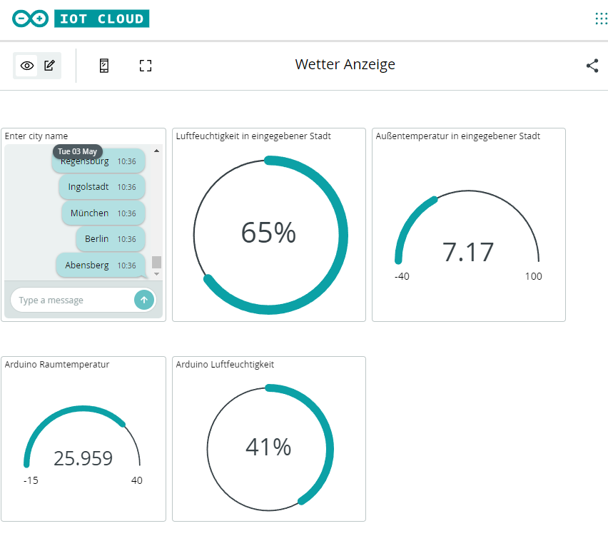
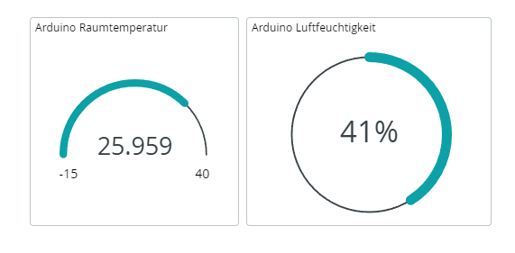
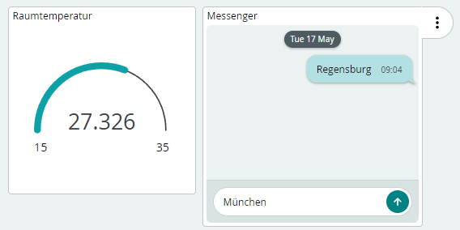
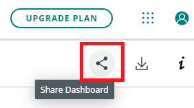
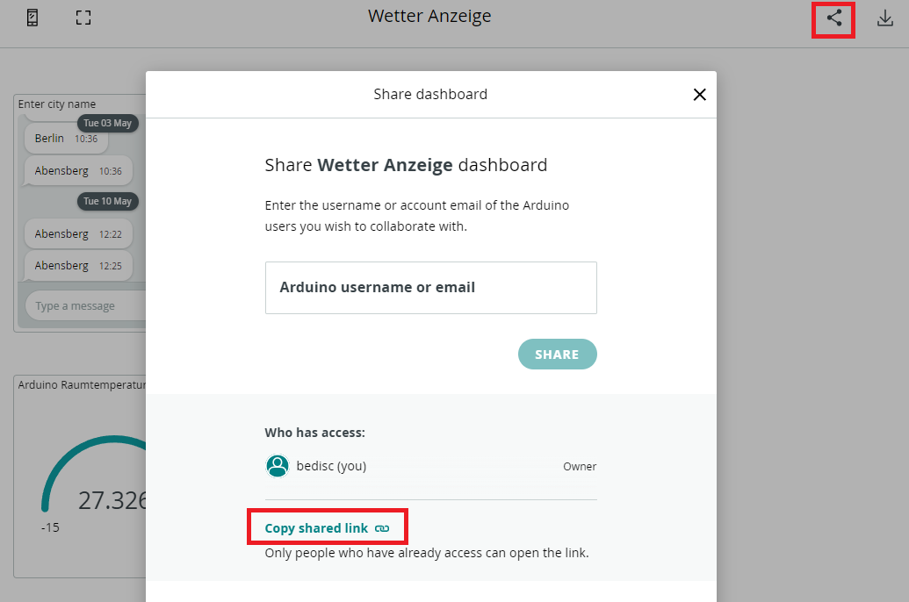
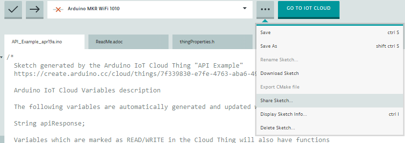
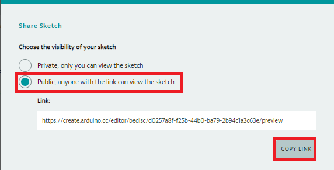

# Lab Challenge 10

> Arbeiten Sie alleine an den Challenges. Sie können sich mit ihrem Coach oder anderen Studierenden austauschen, aber arbeiten Sie nicht zusammen mit anderen Studierenden an einer Challenge und geben Sie auch nicht denselben Code ab.

## Was es zu tun gibt

1. Umschalten zwischen Ansichten mit den Buttons
2. Abfragen und Darstellen der Sensoren Daten
3. Senden von Daten vom der Arduino Cloud an den Arduino
4. Anfragen und Darstellen der Daten der Wetter API
5. Zusammenführen der Zwischenschritte

## Ziel Challenge
Das Ziel dieser Challenge ist Ihre bestehende Wetteranwendung zu einer internationalen Wetterstation umzubauen. Diese Anwendung soll es dann ermöglichen sowohl die Sensordaten anzuzeigen, als auch von anderen Städten weltweit z.B. die aktuelle Temperatur anzuzeigen. Gesteuert wird das Ganze über die Web GUI.

Am Ende soll Ihr Dashboard in etwa so aussehen. 

## Umschalten zwischen Ansichten mit den Buttons
Um verschiedene Werte auf dem Display des Arduinos anzuzeigen soll es im Ersten Schritt ermöglicht werden mit den Buttons zwischen mehreren Texten umzuschalten. 

Folgenden Aufrufe sind dafür notwendig:
Dieser Befehl muss in der Loop Methode aufgerufen werden. Er bewirkt das die Werte gesetzt werden welcher Button gedrückt wurde.
~~~
carrier.Buttons.update();
~~~

Dieser Aufruf gibt zurück, ob der Button 0 gedrückt wurde. (Analog Button 1-4)
~~~
carrier.Buttons.onTouchDown(TOUCH0)
~~~

Ihre Aufgabe ist es zu überprüfen welcher der eizelnen Buttons gedrückt wurden und am Display den Text "Button x" wurde gedrückt auszugeben.

## Abfragen und Darstellen der Sensoren Daten

Im Note wurde bereits genau erklärt wie man die aktuelle Temperatur abfragen und darstellen kann. Ihre Aufgabe ist es jetzt zusätzlich die Luftfeuchtigkeit anzuzeigen.
Folgender Aufruf gibt Ihnen die aktuelle Luftfeuchtigkeit zurück.
~~~
  carrier.Env.readHumidity();
~~~

Anschließend sollte Ihr Dashboard in etwa so aussehen:

  
## Senden von Daten vom der Arduino Cloud an den Arduino

Bisher wurden die Variablen immer nur vom Arduino aus aktualisiert. Jetzt wollen wir Daten auch vom Dashboard aus verändern können. Dies setzen wir mithilfe des "Messenger"-Widget um. Analog zum Gauge-Widget wird dieses Widget unserem Dashboard hinzugefügt. Anschließend wird dieses Widget mit einer Variable vom Typ "Character String" im Thing verknüpft. Zu beachten das diese Variable die Permission "Read & Write" besitzen muss.
In diesem Messenger können jetzt Städtenamen eingegeben werden. Der Arduino verarbeitet diese Information bisher natürlich noch nicht.

Durch die "Read & Write"-Permission wird im Sketch jetzt zusätzlich zu der Variable ein Methoden-Rumpf generiert. Hier wurde die Variable "City" genannt, bei Ihnen kann dies natürlich anders sein. Jedes mal wenn sich jetzt die Variable ändert wird die Methode getDataFromAPI aufgerufen, welche Ihnen bereits aus dem Note bekannt vorkommen sollte.

~~~
/*
  Since City is READ_WRITE variable, onCityChange() is
  executed every time a new value is received from IoT Cloud.
*/
void onCityChange()  {
    // Add your code here to act upon City change
    Serial.println("\nUpdated city to: " + city);
    carrier.display.fillScreen(ST7735_BLACK);
    carrier.display.setCursor(0, 50);
    carrier.display.println("New city: " + city);
  
    getDataFromAPI();
}
~~~

## Anfragen und Darstellen der Daten der Wetter API

Da die API, welche uns die benötigten Wetterdaten zur Verfügung stellt nicht jeder Person unbegrenzt alles kostenlos anbietet muss man sich dort registrieren.
Gehen Sie dazu auf https://home.openweathermap.org/users/sign_up und erstellen Sie sich einen Account.

Damit der Anbieter die Anfragen Ihrem Account zuordnen kann wird ein "API key" verwendet. Dieser ist eindeutig mit Ihrem Account verknüpft. Dieser Key muss geheim gehalten werden, da bei kostenpflichten APIs die Anzahl der Anfragen mit diesem Key über den Preis entscheidet. Dieser Key ist sinnvoll zu benutzen, da ansonsten bei jeder Anfrage Ihre Anmeldedaten mit versendet werden müssten. Ein weiterer Vorteil ist das man bei verschiedenen Anwendungen eigene API Keys erstellen kann und somit nach verfolgen kann welche Anfrage wie viel der Budgets verwendet.

Wenn Sie eingeloggt sind können Sie hier: https://home.openweathermap.org/api_keys alle Ihre aktuellen API-Keys einsehen. Für unseren Anwendungsfall ist natürlich nur ein Key notwendig. Sie können den Default-Key verwenden oder einen eigenen anlegen.

---

Wurde eine neue Stadt eingegeben stellen Sie eine Verbindung zum Server (api.openweathermap.org) her. Verwenden Sie folgende Parameter für Ihre Anfrage:

~~~
    client.print("GET /data/2.5/weather?");
    client.print("q=" + city);
    client.print("&appid=" + apiKey);
    client.print("&cnt=3");
    client.println("&units=metric");
    client.println("Host: api.openweathermap.org");
    client.println("Connection: close");
    client.println();
~~~

Lassen Sie sich im Anschluss das Ergebnis im seriellen Monitor anzeigen und setzen Sie folgende Werte:

~~~
    cityName = JSON.stringify(myObject...  //JSON.stringify wird verwendet um String Werte umzuwandeln
    weatherDescription = JSON.stringify(myObject...
    temperature = myObject....
    feelsLike = myObject...
    windSpeed = myObject...
    pressure = myObject...
    received_humidity = myObject...
~~~

Nun soll die Temeratur der abgefragten Stadt im Arduino Display angezeigt werden.

## Zusammenführen der Zwischenschritte

Die fertige Anwendung soll folgende Anforderungen erfüllen:

  - Bei Klick auf Button 0 soll:
    - Die Daten der zuletzt eingegebenen Stadt erneut abgefragt werden & anschließend die Temperatur in dieser Stadt angezeigt werden
  - Bei Klick auf Button 1 soll:
    - Die Temperatur in der zuletzt abgefragten Stadt angezeigt werden
  - Bei Klick auf Button 2 soll:
    - Die gefühlte Temperatur in der zuletzt abgefragten Stadt angezeigt werden
  - Bei Klick auf Button 3 soll:
    - Die Wetter Beschreibung der zulezte abgefragten Stadt angezeigt werden   
  - Bei Klick auf Button 4 soll:
    - Am Display die aktuelle Raumtemperatur und Raumluftfeuchtigekeit angezeigt werden
  - Die Raumtemperatur & Raumluftfeuchtigkeit sollen bei Schwankungen größer 0.1 in der Web GUI aktualisiert werden
  - Die abgefragten Werte Wetter Beschreibung, Temperatur, Gefühlte Temperatur, Windgeschwindigkeit, Luftdruck & Luftfeuchtigkeit sollen in der GUI immer aktualisiert werden wenn sie zum ersten mal abgefragt wurden oder aktualisiert wurden
  - Achten Sie bei Ausgaben am Arduino Display darauf, nicht nur Zahlen auszugeben sondern auch eine Beschreibung was angezeigt wird & ggf. eine Einheit

## Abgabe

@mheckner 
//Vermutlich muss das noch angepasst werden wo genau der Link hingeschickt werden soll.

Zur Abgabe erstellen Sie einen "Shared Link" Ihres Dashboards (siehe Screenshot), legen ein neues Repository an und fügen Sie den Link in die readMe.md Datei ein.

 

In der gleichen Datei fügen Sie den Link zu Ihrem geteilten Code ein (siehe Screenshot). Anschließend stellen das Repository dem Betreuer zur Korrektur zur Verfügung.

 
