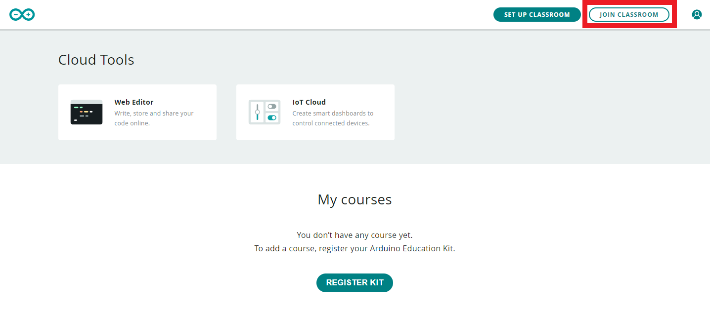
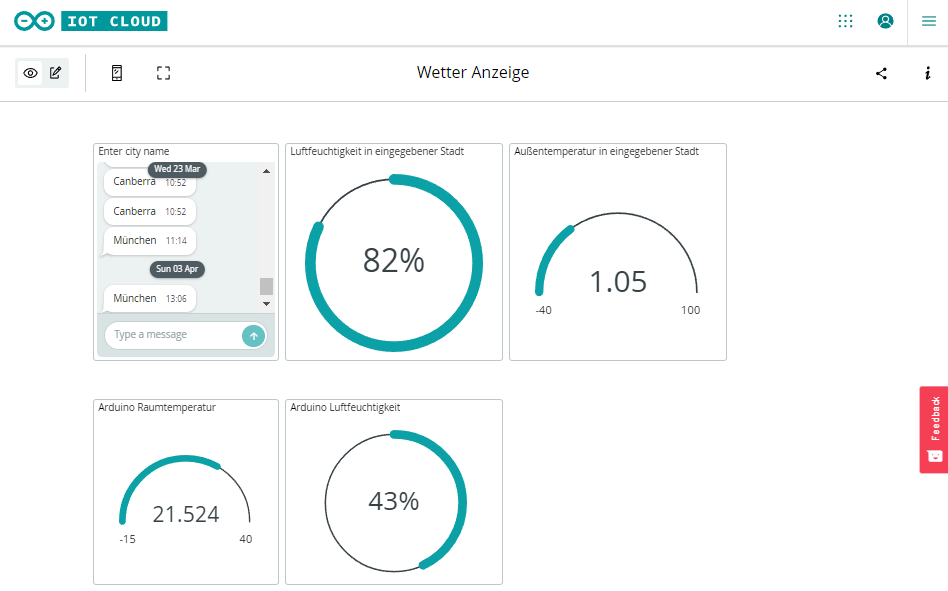
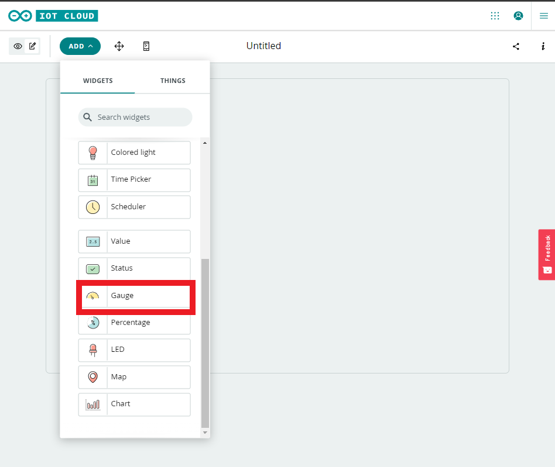
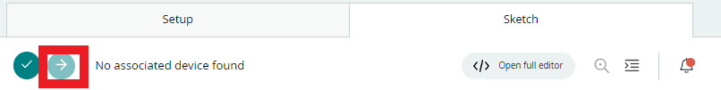

# Lab Challenge 10

> Arbeiten Sie alleine an den Challenges. Sie können sich mit ihrem Coach oder anderen Studierenden austauschen, aber arbeiten Sie nicht zusammen mit anderen Studierenden an einer Challenge und geben Sie auch nicht denselben Code ab.

## Was es zu tun gibt

1. Arduino einrichten
2. Programmieren eigene **Temperaturanzeige**
  - Arduino aufbauen
  - Thing erstellen
  - Variablen konfigurieren
  - Sketch verstehen
  - Dashboard erstellen
  - Programm erstellen
  - Auf den Arduino hoch laden
3. Temperaturanzeige zur internationalen Wetteranwendung umbauen

## Arduino einrichten

Führen Sie die folgenden Schritte durch, um auf dem Arudino programmieren zu können:

1. Registrieren Sie sich mit Ihrer studentischen E-Mail-Adresse bei https://classroom.arduino.cc/ ?????
2. Nutzen Sie den Code "JkqKcqUT" um den Aruino Klassenraum beizutreten
3. Registrieren Sie das Arudino IoT Kit 

Mit der Arduino Cloud lässt sich einfach der Arduino programmieren und Dashboards erstellen auf denen Ihr Daten abrufen oder sie an den Arduino senden könnt.
Dafür muss zu erst die das Dashboard konfiguriert werden.

## Dashboard einrichten
### Arduino aufbauen

Den Arduino und das Shield auspacken und richtig herum zusammenstecken. **Umbedingt auf die Beschriftung der PINS achten!**
Anschließend den Arduino mit dem beiliegenden Mikro-USB-Kabel an deinen PC anschließen.

### Thing erstellen

Ein Thing ist die Repräsentation eines physisches Geräts, in unserem Fall der Arduino. Dieses muss zuerst online definiert werden damit die Website die Daten entsprechend zuordnen kann.
Klicke auf der Startseite https://classroom.arduino.cc/ auf "IoT Cloud". Klicke dann auf "Create Thing".

1. Im angezeigten Bildschirm vergeben wir zuerst einen passenden Namen, dazu einfach oben auf "Untitled" klicken und einen Namen wie z.B. "Wetterstation" vergeben.
2. Als nächstes verbinden wir unseren Arduino mit dem Thing. Dazu rechts auf Select Device klicken und den Anweisungen folgen
3. Verbindung mit dem WLAN herstellen. Rechts unten bei "Network" auf "Configure" gehen und deine WLAN Daten hinterlegen.

### Variablen konfigurieren

Die Variablen die gelesen bzw. beschrieben werden können nicht einfach im Programmcode definiert werden, da die Plattform nicht automatisch die Verbindung zu unseren definierten Variablen herstellen kann.
Deshalb müssen alle Variablen die später über das Dashboard ereichbar sein müssen mit "Add Variable" angelegt werden.

Um die Funktionsweise zu demonstrieren werden wir im folgenden die Variable für die Raumtemperatur konfigurieren. Im Anschluss wird es deine Aufgabe sein 
die anderen benötigten Variablen für das Projekt selbst zu konfigurieren.

Wir vergeben einen passenden Namen "Raumtemperatur" und wählen den Datentyp "Floating Point Number".

Bei den Berechtigungen gibt es die Optionen 
 - Read & Write
   Wird für Variablen verwendet deren Wert über das Dashboard verändert werden kann. Beispiele wären Lichtschalter, Temperatureinstellungen,... die gesteuert werden sollen.
 - Read Only
   Für Variablen die nur zur Datenübertragung vom Gerät zum Dashboard verwendet werden. Beispiele wären die aktuelle Raumtemperatur, Luftfeuchtigkeit,...

Da die Raumtemperatur nur gelesen werden soll wählen wir hier "Read Only" aus.

Bei den Update Policy gibt es die Optionen
  - On Change
  Variablen werden nur geupdated wenn sich der Wert verändert. Dies ist sinnvoll für Dinge die z.B. nur alle paar Sekunden auftreten. 
  Der genaue Zeitabstand hängt von der Anwendungssituation ab. Ist es sehr wichtig immer aktuelle Daten zu haben muss der Zeitabstand geringer sein, als z.B. bei der Raumtemperatur.
  Der Threshhold gibt an ab welcher Wertschwankung aktualisiert wird. 
  - Periodically
  Die Werte werden in einem bestimmten Zeitabstand aktualisiert. Dies ist Beispielsweise sinnvoll wenn man Diagramme die den zeitlichen Verlauf darstellen erstellen möchte.
  Im Feld wird angegeben in welchem Zeitabstand aktualisiert wird.
  
Wir wählen für die Raumtemperatur "Periodically" alle 5sec. Hier anzumerken ist, das andere Einstellungen ebenso funktionieren würden.

Abschließend bestätigen wir unsere Eingabe mit "Add variable", die Variable sollte nun angezeigt werden. 

### Sketch verstehen

Im Sketch findet das eigentliche Programmieren statt. Rechts neben "Sketch" wird jetzt auch gekennzeichnet, das das Programm durch die Erstellung der Variable
im Programmcode etwas geändert hat. Wenn wir den Code genauer ansehen sehen wir oben im Kommentar

~~~ The following variables are automatically generated and updated when changes are made to the Thing
  float raumtemperatur;
~~~
  
Andere Variablen die später angelegt werden, werden hier auch angezeigt werden. 

~~~
/*
  Since Raumtemperatur is READ_WRITE variable, onRaumtemperaturChange() is
  executed every time a new value is received from IoT Cloud.
*/
void onRaumtemperaturChange()  {
  // Add your code here to act upon Raumtemperatur change
}
~~~
Als Beispiel, hätten wir READ_WRITE gewählt würde zusätzlich dieser Methodenrumpf generiert werden.
Dieser ist relevant für Änderungen die am Dashboard vorgenommen werden. Hier könnte definiert werden, was passieren soll wenn die Variable verändert wird.

Weitere Bestandteile des Sketchs die wir kurz genauer betrachten sollten sind:

~~~
void setup() {
 
}
~~~

In der Setup Methode werden Dinge beim Start des Arduinos erledigt. Beispielsweise das Herstellen der Verbindung zum WLAN,...

Die zweite Methode ist die Loop Methode
~~~
void loop() {
}
~~~
In dieser wird überprüft ob Knöpfe gedrückt wurden, können Sensoren ausgelesen werden, usw.
Später dazu mehr.

### Dashboard 

So oder so ähnlich soll euer Dashboard mal aussehen. 

Dazu geht ihr auf https://create.arduino.cc/iot/dashboards und klickt auf "Build Dashboard".

Nun fügen wir ein sogenanntes "Gauge"-Widget auf unser Dashboard hinzu. Im Fenster das sich öffnet könnt ihr dem Ganzen noch einen Namen "Raumtemperatur" geben und einen Wertebereich festlegen in dem sich die Temperaturdarstellung bewegen soll. Beispielsweise für die Raumtemperatur passen sind Werte zwischen 15 und 35 Grad Celsius. 
Sehr wichtig hier verknüpfen wir jetzt auch über "Link Variable", das Widget mit der vorher definierten Variable. Damit wäre die Seite vom Dashboard erledigt, jetzt muss nur noch die Variable mithilfe des Arduinos mit Werten befüllt werden.

### Variablen Werte setzten

Das Shield auf dem Ihr zuvor den Arduino angebracht habt besitzt neben dem Display, Tasten auch verschiedene Sensoren. Diese wollen wir nun nutzen. 
Als Erstes müssen wir das Ganze Initalisieren, dies passiert in der Setup Methode.
Den folgenden Codeauschnitt könnt Ihr einfach in euren Code übernehmen
~~~
void setup() {
  // Initialize serial and wait for port to open:
  Serial.begin(9600);
  // This delay gives the chance to wait for a Serial Monitor without blocking if none is found
  delay(1500);
  
  CARRIER_CASE = false;
  carrier.begin();
  carrier.display.setRotation(0);

  carrier.display.fillScreen(ST7735_BLACK);
  carrier.display.setCursor(0, 60);
  carrier.display.setTextColor(ST77XX_WHITE);
  carrier.display.setTextSize(2);
  carrier.display.println("Booting...");

  // Defined in thingProperties.h
  initProperties();

  // Connect to Arduino IoT Cloud
  ArduinoCloud.begin(ArduinoIoTPreferredConnection);
  //Get Cloud Info/errors , 0 (only errors) up to 4
  setDebugMessageLevel(2);
  ArduinoCloud.printDebugInfo();

  //Wait to get cloud connection to init the carrier
  while (ArduinoCloud.connected() != 1) {
    ArduinoCloud.update();
    delay(500);
  }
}
~~~

Als zweiten Schritt werden jetzt kontinuierlich die Werte des Sensors gelesen und in die zuvor definierte Variable geschrieben. Solltet ihr eure Variable zuvor anders genannt haben müsst ihr den folgenden Codeauschnitt natürlich entsprechend anpassen.

~~~
void loop() {
  ArduinoCloud.update();
  delay(100);
  
  raumtemperatur = carrier.Env.readTemperature();
 }
~~~

Jetzt muss das Programm nur noch auf den Arduino hoch geladen werden und ihr habt erfolgreich eure eigene Online Temperatur Anzeige gebaut. :)

## Erweiterung zur internationalen Wetteranwendung umbauen

