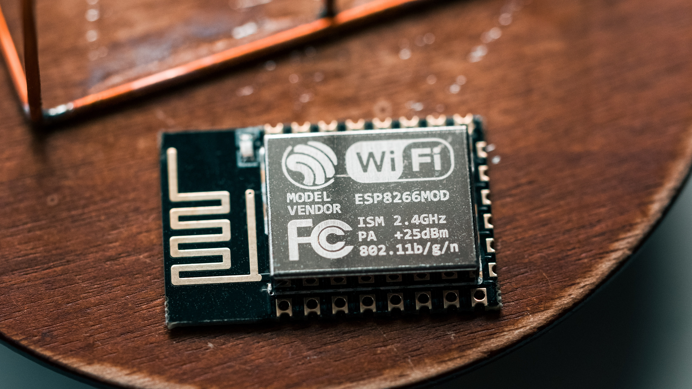
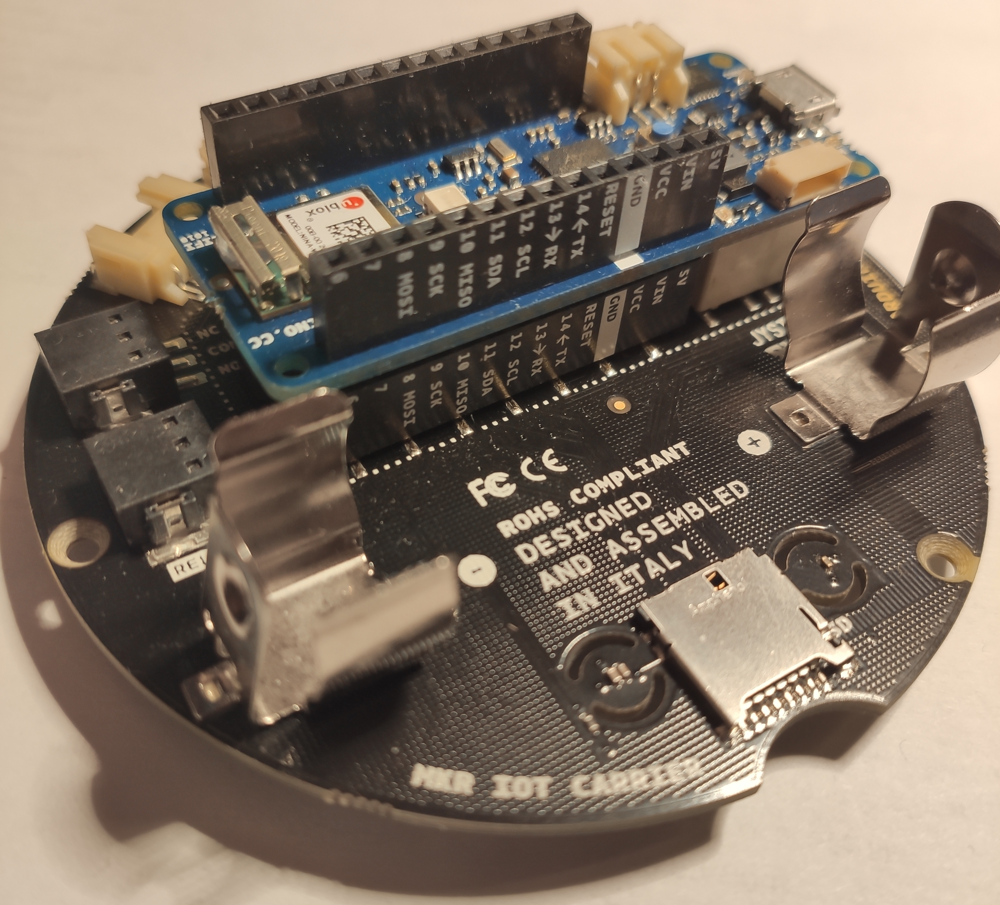
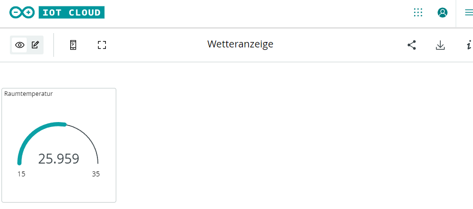

# IoT
In dieser Challenge soll das IoT ("Internet of Things") vorgestellt werden. IOT ist ein Begriff in dem man im Internet und später auch im Berufsleben immer mal wieder stoßen wird. Aber was genau versteht man darunter und was kann man genau damit machen?

Grundsätzlich geht es dabei darum physikalische Geräte die mit verschiedenen Sensoren ausgestattet sind über das Internet mit einander zu vernetzen. Das Ganze beginnt bei einfachen Geräten wie der Temperaturfühler am Fensterbrett der die aktuelle Temperatur und Luftfeuchtigkeit an euer Handy sendet bis hin zu komplexen Industrieanwendungen wie Fertigungsroboter die mit einander Daten austauschen um komplette Produktionsanlagen zu automatisieren.

### Was braucht man alles dafür?
Egal welches Gerät, Kernelement eines jeden Geräts das vernetzt werden soll ist ein Microcontroller. Diese kommen in unterschiedlichsten Ausführungen und Austattungen, beginnend bei sehr einfachen wie den ESP8266 Modulen die sehr günstig sind und vereinfacht nur mit einem Prozessor, einem WLAN-Modul und PINS zum Anschließen von Sensoren ausgestattet sind. Bis hin zu umfangreichen wie den Raspberry PI 4, welcher alle Bestandteile eines einfachen Desktop-PCs beinhaltet (inklusive kompletten Betriebssysten und Anschlüssen wie HDMI-, USB-, AUX-, LAN-Anschlüsse...)

Wir werden in dieser Challenge mit dem Arduino IOT Kit arbeiten. Dieses beinhaltet neben dem Microcontroller -einem Arduino- ein sogenanntes Shield beinhaltet. Dieses Shield erweitert den Arduino und ist mit verschiedensten Sensoren (Temperatur, Luftfeuchtigkeit), Touch-Buttons, sowie einem kleinen Display ausgestattet. 

Im folgenden wird erklärt wie ihr eine einfache Temperaturanzeige selbst programmieren könnt.

## Was es zu tun gibt

1. Arduino einrichten
2. Programmieren eigene **Temperaturanzeige**
  - Arduino aufbauen
  - Thing erstellen
  - Variablen konfigurieren
  - Sketch verstehen
  - Dashboard erstellen
  - Programm erstellen
  - Auf den Arduino hoch laden
3. Daten von einer Website abfragen

## Arduino einrichten

Der Arduino ist ein Microcontroller, dieser weiß aktuell aber nicht was er überhaupt machen soll. Um ihn zu programmieren gibt es verschieden Möglichkeiten, wir werden ihn über Arduino Cloud programmieren, da diese uns viele Funktionen zur Verfügung stellt. Für uns insbesondere interessant sind die Dashboards, welche uns ermöglichen Daten von Sensoren übersichtlich darzustellen und Daten an den Arduino zu senden. 

Führt folgenden Schritte durch, um auf dem Arudino programmieren zu können:

1. Registrieren Sie sich mit Ihrer studentischen E-Mail-Adresse bei https://classroom.arduino.cc/ @Prof. Heckner: oder E-Mails erstellen die weiter gegeben werden?
2. Nutzt den Code "JkqKcqUT" um den Aruino Klassenraum beizutreten
3. Registriert das Arudino IoT Kit 

### Arduino aufbauen

Den Arduino und das Shield auspacken und richtig herum zusammenstecken. **Umbedingt auf die Beschriftung der PINS achten!**
Anschließend den Arduino mit dem beiliegenden Mikro-USB-Kabel an deinen PC anschließen.

Aufgebaut sollte der Arduino mit dem Shield so aussehen, die Beschriftung der PINS ist gleich (z.B. in weiß der GND Anschluss)

## Dashboard einrichten
### Thing erstellen

Ein Thing ist die Repräsentation eines physisches Geräts, in unserem Fall der Arduino. Dieses muss zuerst online definiert werden damit die Website die Daten entsprechend zuordnen kann. (Erinnerung: IOT = Internet of Things)
Klicke auf der Startseite https://classroom.arduino.cc/ auf "IoT Cloud". Klicke dann auf "Create Thing".

1. Im angezeigten Bildschirm vergeben wir zuerst einen passenden Namen, dazu einfach oben auf "Untitled" klicken und einen Namen wie z.B. "Wetterstation" vergeben.
2. Als nächstes verbinden wir unseren Arduino mit dem Thing. Dazu rechts auf "Select Device" klicken und den Anweisungen folgen
3. Verbindung mit dem WLAN herstellen. Rechts unten bei "Network" auf "Configure" gehen und deine WLAN Daten hinterlegen.

### Variablen konfigurieren

Die Daten die zwischen der Arduino Cloud und dem Arduino ausgetauscht werden, werden über spezielle Variablen getauscht. Diese sind an beiden Enden sichtbar und der zugewiesene Wert ist je nach Einstellung direkt am Anderen Ende abrufbar.

Diese besonderen Variablen die später über das Dashboard ereichbar sein müssen mit "Add Variable" angelegt werden.

Um die Funktionsweise zu demonstrieren werden wir im folgenden die Variable für die Raumtemperatur konfigurieren.

Wir vergeben einen passenden Namen "Raumtemperatur" und wählen den Datentyp "Floating Point Number".

Bei den Berechtigungen gibt es die Optionen 
 - Read & Write
   Wird für Variablen verwendet deren Wert über das Dashboard verändert werden kann. Beispiele wären Lichtschalter, Temperatureinstellungen,... die gesteuert werden sollen.
 - Read Only
   Für Variablen die nur zur Datenübertragung vom Gerät zum Dashboard verwendet werden. Beispiele wären die aktuelle Raumtemperatur, Luftfeuchtigkeit,...

Da die Raumtemperatur nur gelesen werden soll wählen wir hier "Read Only" aus.

Bei den Update Policy gibt es die Optionen
  - On Change
  Variablen werden nur geupdated wenn sich der Wert verändert. Dies ist sinnvoll für Dinge die z.B. nur alle paar Sekunden auftreten. 
  Der genaue Zeitabstand hängt von der Anwendungssituation ab. Ist es sehr wichtig immer aktuelle Daten zu haben muss der Zeitabstand geringer sein, als z.B. bei der Raumtemperatur.
  Der Threshhold gibt an ab welcher Wertschwankung aktualisiert wird. Uns interessiert z.B. nicht wenn sich die Raumtemperatur um 0.001 Grad verändert, in anderen Anwendungssituationen kann dies natürlich enormen Einfluss auf die Anwendung haben.
  - Periodically
  Die Werte werden in einem bestimmten Zeitabstand aktualisiert. Dies ist Beispielsweise sinnvoll wenn man Diagramme die den zeitlichen Verlauf darstellen erstellen möchte.
  Im Feld wird angegeben in welchem Zeitabstand aktualisiert wird.
  
Wir wählen für die Raumtemperatur "Periodically" alle 5sec. Hier anzumerken ist, das andere Einstellungen ebenso funktionieren würden.

Abschließend bestätigen wir unsere Eingabe mit "Add variable". Die Variable sollte nun angezeigt werden. 

### Sketch verstehen

Im Sketch findet das eigentliche Programmieren statt. Rechts neben "Sketch" wird jetzt auch gekennzeichnet, das das Programm durch die Erstellung der Variable
im Programmcode etwas geändert hat. Wenn wir den Code genauer ansehen sehen wir oben im Kommentar

~~~ The following variables are automatically generated and updated when changes are made to the Thing
  float raumtemperatur;
~~~
  
Andere Variablen die später angelegt werden, werden hier auch angezeigt werden. 

~~~
/*
  Since Raumtemperatur is READ_WRITE variable, onRaumtemperaturChange() is
  executed every time a new value is received from IoT Cloud.
*/
void onRaumtemperaturChange()  {
  // Add your code here to act upon Raumtemperatur change
}
~~~
Als Beispiel, hätten wir READ_WRITE gewählt würde zusätzlich dieser Methodenrumpf generiert werden.
Dieser ist relevant für Änderungen die am Dashboard vorgenommen werden. Hier könnte definiert werden, was passieren soll wenn die Variable verändert wird.

Weitere Bestandteile des Sketchs die wir kurz genauer betrachten sollten sind:

~~~
void setup() {
 
}
~~~

In der Setup Methode werden Dinge beim Start des Arduinos erledigt. Beispielsweise das Herstellen der Verbindung zum WLAN,...

Die zweite Methode ist die Loop Methode
~~~
void loop() {
}
~~~
In dieser wird z.B. überprüft ob Knöpfe gedrückt wurden, können Sensoren ausgelesen werden, usw.
Später dazu mehr.

### Dashboard 

So oder so ähnlich soll euer Dashboard mal aussehen. 
Dazu geht ihr auf https://create.arduino.cc/iot/dashboards und klickt auf "Build Dashboard".

Nun fügen wir ein sogenanntes "Gauge"-Widget auf unser Dashboard hinzu. Im Fenster das sich öffnet könnt ihr dem Ganzen noch einen Namen "Raumtemperatur" geben und einen Wertebereich festlegen in dem sich die Temperaturdarstellung bewegen soll. Beispielsweise für die Raumtemperatur passen sind Werte zwischen 15 und 35 Grad Celsius. 
Sehr wichtig hier verknüpfen wir jetzt auch über "Link Variable", das Widget mit der vorher definierten Variable. Damit wäre die Seite vom Dashboard erledigt, jetzt muss nur noch die Variable mithilfe des Arduinos mit Werten befüllt werden.

### Variablen Werte setzten

Das Shield auf dem Ihr zuvor den Arduino angebracht habt besitzt neben dem Display, Tasten auch verschiedene Sensoren. Diese wollen wir nun nutzen. 
Als Erstes müssen wir das Ganze Initalisieren, dies passiert in der Setup Methode.
Den folgenden Codeauschnitt könnt Ihr einfach in euren Code übernehmen, auf einzelne Bestandteile wird später genauer eingegangen. 
~~~
void setup() {
  // Initialize serial and wait for port to open:
  Serial.begin(9600);
  // This delay gives the chance to wait for a Serial Monitor without blocking if none is found
  delay(1500);
  
  CARRIER_CASE = false;
  carrier.begin();
  carrier.display.setRotation(0);

  carrier.display.fillScreen(ST7735_BLACK);
  carrier.display.setCursor(0, 60);
  carrier.display.setTextColor(ST77XX_WHITE);
  carrier.display.setTextSize(2);
  carrier.display.println("Booting...");

  // Defined in thingProperties.h
  initProperties();

  // Connect to Arduino IoT Cloud
  ArduinoCloud.begin(ArduinoIoTPreferredConnection);
  //Get Cloud Info/errors , 0 (only errors) up to 4
  setDebugMessageLevel(2);
  ArduinoCloud.printDebugInfo();

  //Wait to get cloud connection to init the carrier
  while (ArduinoCloud.connected() != 1) {
    ArduinoCloud.update();
    delay(500);
  }
}
~~~

Als zweiten Schritt werden jetzt kontinuierlich die Werte des Sensors gelesen und in die zuvor definierte Variable geschrieben. Solltet ihr eure Variable zuvor anders genannt haben müsst ihr den folgenden Codeauschnitt natürlich entsprechend anpassen.

~~~
void loop() {
  ArduinoCloud.update();
  delay(100);
  
  raumtemperatur = carrier.Env.readTemperature();
 }
~~~

Jetzt muss das Programm nur noch auf den Arduino hoch geladen werden und ihr habt erfolgreich eure eigene Online Temperatur Anzeige gebaut. :)

### Shield Display nutzen

Um nicht immer die Website aufrufen zu müssen, möchten wir zusätzlich noch das angeschlossene Display nutzen um die Raumtemperatur darzustellen. 

Folgende Befehle sind für das Display wichtig

~~~
 carrier.display.fillScreen(ST7735_BLACK);
~~~
Mit diesem Befehl wird alles auf dem Display durch einen schwarzen Hintergrund ersetzt. Man kann ihn also nutzen um das Display zurück zu setzten. Später wird das nützlich werden wenn wir zwischen verschiedenen Ausgaben umschalten wollen.

~~~
 carrier.display.setCursor(0, 60);
~~~
Mit diesem Befehl kann der Cursor frei im Display platziert werden. Ausgangspunkt der Abstände ist immer die linke obere Ecke. Der Erste Parameter gibt die Verschiebung nach unten an, der Zweite die Verschiebung nach Rechts. In diesem Beispiel (0, 60) würde dies bedeuten das die Nachfolgende Ausgabe ganz oben und leicht nach rechts versetzt erscheint. 

~~~
  carrier.display.println("Beispiel");
  carrier.display.print("Beispiel2");
~~~
Dies sind die beiden Möglichkeiten um Text am Display auszugeben. Sie unterscheiden sich darin, dass die "println" ("print line")-Variante automatisch die restliche Zeile ausfüllt, heißt die nächste Ausgabe in der nächsten Zeile ausgegeben wird. Bei der "print"-Variante wird der Text bei der nächsten Ausgabe direkt dahinter fort gesetzt. Dies kann besonders bei Variablen nützlich sein.

~~~
  carrier.display.print("Variablenwert: ");
  carrier.display.print(x);
~~~
Diese Ausgabe würde dazu führen, dass in einer Zeile z.B. "Variablenwert 3" steht. (Angenommen die Variable x hat den Wert 3)

## 3. Daten von einer Website abfragen

Da für sehr viele Anwendung nicht nur Daten die selbst im eigenen Netzwerk gesammelt wurden interessant sind müssen häufig Daten über das Internet abgefragt werden. Diese werden über sogenannte APIs ("Application Programming Interface", de: Anwendungs Programmierschnittstellen) zur Verfügung gestellt. Einfach formuliert handelt es sich dabei um Schnittstellen zu anderen Programmen welche Daten in einem bestimmten Format zur Verfügung stellen.

Im folgenden wollen wir eine weitere einfache Anwendung erstellen welche Fakten über Katzen abfrägt: catfact.ninja

Die Setup Methode, includes und Variablen enthalten keine besonderen Änderungen und können direkt übernommen werden.
~~~ 
#include <Arduino_JSON.h>
#include <Arduino_MKRIoTCarrier.h>
#include "thingProperties.h"
MKRIoTCarrier carrier;
char server[] = "catfact.ninja";

WiFiClient client;

void setup() {
  Serial.begin(9600);
  delay(1500); 

  initProperties();
  ArduinoCloud.begin(ArduinoIoTPreferredConnection);

  setDebugMessageLevel(2);
  ArduinoCloud.printDebugInfo();

  while (ArduinoCloud.connected() != 1) {
    ArduinoCloud.update();
    delay(500);
  }
  
  initCarrierAndDisplay();
  Serial.println("init finished");
  carrier.display.fillScreen(ST7735_BLACK);
  carrier.display.setCursor(0, 60);
  carrier.display.print("Started");
}
~~~

Damit nicht laufenden die Daten abgefragt werden reagieren wir in der loop-Methode nur auf den Button-Click der 0-Taste um dann Daten anzufragen.
~~~
void loop() {
  ArduinoCloud.update();
  carrier.Buttons.update();
  
  if (carrier.Buttons.onTouchDown(TOUCH0)) {
    Serial.println("requesting");
    getDataFromAPI();
  }
}
~~~

In der getDataFromAPI-Methode wird jetzt eine Verbindung zum Server hergestellt. Besonders zu beachten hierbei ist der connectSSL-Aufruf auf den Port 443. Dies ist notwendig da die Daten nur über das HTTPS Protokoll abgefragt werden könnnen. Sind die Daten über HTTP erreichbar funktioniert dies über einen client.connect-Aufruf auf den Port 80.
~~~
void getDataFromAPI(){
  if (client.connectSSL(server, 443)) {
    buildHttpRequest();
  } else {
    Serial.println("unable to connect");
  }
  delay(1000);
  Serial.println("requested build");

  if (client.connected()) {
    handleHttpResponse();
    beepSound();
  }
}
~~~

Die Parameter der Anfrage werden in der buildHttpRequest-Methode gesetzt. Mit dem Abschließenden client.println(); wird die Anfrage abgeschickt.

~~~
void buildHttpRequest(){
  client.println("GET /fact HTTP/1.1");
  client.println("Host: catfact.ninja");
  client.println("Connection: close");
  client.println(); 
}
~~~
Um den die eigentliche JSON-Datei aus der Antwort des Servers auszulesen muss einiges übersprungen werden da der Server zusätzliche Daten im Header mitsendet die uns hier nicht interessieren.

In dieser Ersten Hälfte der handleHttpResponse-Methode passiert genau dies. Mithilfe der find-Methode lässt sich nach bestimmten Stellen suchen. Ein für uns praktischer Nebeneffekt ist, dass der Curser bis zu diesem Punkt verschoben wird. Somit können wir Teile bis zu dieser Stelle überspringen.

~~~
void handleHttpResponse(){
  
  char endOfHeader[] = "\r\n\r\n"; // Definieren einer RegExp die das Ende des Headers kennzeichnet
  if(!client.find(endOfHeader)){  // Überspringen bis zum Ende des Headers
    Serial.println("Invalid response");
    return;
  }

  client.find('\n'); // Zwischen Header-Ende und dem JSON-Wert ist eine Leerzeile, hiermit wird diese übersprungen
  String line = client.readStringUntil('\n'); // Einlesen des JSON-Werts in die Variable "line"
  ....
~~~

Folgende Codeauschnitte müssen am Ende der handleHttpResponse-Methode eingefügt werden. Gerne kann mit den einzlenen Zwischenschritten experimentiert werden um zu sehen wie das Zwischenergebnisse aussehen.

### JSON Format auslesen
Das häufigste verwendete Format in dem APIs ihre Daten zurück geben ist im so genannten JSON Format ("JavaScript Object Notation"). Dieses Format hat den Vorteil, dass es sowohl von Menschen als auch den PC einfach lesbar ist und sehr kompakt ist. 
Für dieses Datei Format gibt es in jeder gängigen Programmiersprache "Parser", diese verarbeiten das JSON und ermöglichen einfachen Zugriff auf die einzelnen Werte ohne selbst viel dafür programmieren zu müssen.

~~~
JSONVar myObject = JSON.parse(line);
~~~
Dieser Befehl wandelt den String "line" in eine JSON Variable um, mit welcher wir nun leicht arbeiten können.

~~~
String catFact = JSON.stringify(myObject["fact"]);
Serial.println(catFact); 
~~~
Mit dem JSON.stringify können wir die Daten welche am Identifier "fact" hinterlegt sind abfragen. Grundvoraussetzung ist natürlich zu wissen wie das JSON aufgebaut ist und an welcher Stelle, welche Daten liegen. Diese Information muss aber entweder vom Anbieter der API bereitgestellt werden, bzw. muss selbst ausgelesen werden. 

