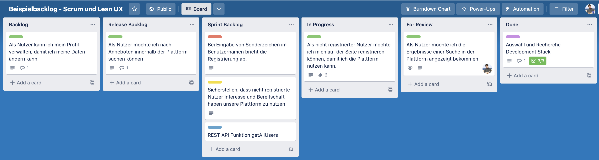

# Agiles Projektmanagement mit Scrum

Agiles Projektmanagement ist eine Methode, bei der ein (digitales) Produkt nicht von Anfang an fertig geplant und dann ohne Änderungen bis zum Ende implementiert wird, sondern bei der die Entwicklung in kleineren Schritten erfolgt, die eine Kurskorrektur während der Entwicklungszeit ermöglicht.

## Traditionelles vs. agiles Projektmanagement

#### Traditionelles Projektmanagement (Wasserfallmodell)

Früher ging man davon aus, dass sich alle Anforderungen (d.h. gewünschte Funktionen) an ein Produkt (z.B. eine Software) zu Beginn des Projekts definieren lassen. Dazu wurden die Anforderungen einmalig dokumentiert. Anforderungen für eine App wie Facebook könnten sein: Nutzer müssen sich einloggen können, Nutzer müssen Posts erstellen können, Nutzer müssen Posts anderer Nutzer "liken" können, usw. Im weiteren Verlauf des Projekts muss das Team diese Anforderungen implementieren, d.h. die App über Monate oder Jahre hinweg entwickeln, die alle Anforderungen erfüllt. In einem abschließenden User Acceptance Test (UAT) soll dann festgestellt werden, ob alle Anforderungen erfüllt wurden.

Dieser Ansatz bringt die folgenden Risiken mit sich:

* Anforderungen zu Beginn einer Produktentwicklung sind in Gänze schwer abzuschätzen - Nutzer tun sich sehr schwer damit Wünsche zu äußern, wenn sie sich diese "ausdenken müssen". Dies kann zu den folgenden Ergebnissen führen:
  * Im Zweifelsfall wird sich alles gewünscht. Die Folge ist eine teure Software bzw. ein teures Produkt, das in der Benutzung kompliziert ist, weil es über viele Features verfügt. Es kann sein, dass viele Funktionen am Ende garnicht benötigt werden, und die Nutzer nur gedacht haben, dass diese wichtig sind. Somit wurde "waste" produziert.
  * Die Software trifft nicht die Anforderungen der Nutzer. Im abschließenden Test (UAT) merken die Nutzer erst durch die Benutzung der Software / des Produkts, dass Sie Features benötigen, an die sie noch garnicht gedacht haben. Auch dies erhöht die Kosten der Softwareentwicklung, da jetzt neue Features entwickelt werden müssen, obwohl man angenommen hat, das Projekt sei bereits beendet. Implementiert man diese Features nicht nachträglich ist ein Produkt entstanden, das Niemandem nutzt.
* Wird das Produkt nach dem Wasserfallmodell entwickelt, wird parallel an unterschiedlichen Teilen gearbeitet, die erst am Ende zusammengefügt werden. Somit kann das Produkt erst am Ende von Nutzern getestet werden. Es kann sein, dass Anforderungen, die man zu Beginn des Projekts als wichtig erachtet hat, garnicht mehr relevant sind oder sich neue Anforderungen ergeben, die zu Projektbeginn noch nicht bekannt waren. Somit wurde ein "veraltetes" Produkt entwickelt.

#### VUCA - Eine komplexe und unsichere Welt

Insesondere ist diese sequentielle Herangehensweise, bei der man erst alle Anforderungen erhebt, dann das Produkt entwickelt, das erst am Ende testbar ist, durch eine komplexe Welt herausgefordert. Dies lässt sich durch das Akronym (VUCA - vgl. https://hbr.org/2014/01/what-vuca-really-means-for-you, https://digitalleadership.com/blog/vuca-world/#VUCA_world_Examples_from_the_business_world) beschreiben:

* **Volatility** - Situationen verändern sich schnell und sind von unbekannter Dauer. z.B. steigende Energiepreise durch politische Krisen.
* **Uncertainty** - Externe Ereignisse könnten die eigene Situation verändern, müssen es aber nicht. z.B. Tesla entwickelt elektrische Fahrzeuge, die bestehende Hersteller bedrohen könnten.
* **Complexity** - Es gibt viele Zusammenhänge unterschiedlicher Komponenten, von denen manche vorhersehbar sind, manche aber nicht analysierbar sind. z.B. ist es schwer zu beurteilen, welche Effekte künstliche Intelligenz wie ChatGPT auf geistige und kreative Tätigkeiten wie Journalismus und Wissenschaft haben wird. 
* **Ambiguity** - Kausale Zusammenhänge sind unklar, es gibt viele "unknown unknowns", d.h. unbekannte Dinge, die man nicht vorhersehen kann. z.B. eine Firma startet ein neues Produkt, das es zuvor noch nicht gegeben hat.

Die folgenden Beispiele verdeutlichen, wie die Dimensionen von VUCA die Produktentwicklung beeinflußen können:

* Smartphones (Volatilität) - Früher könnten Telefone jahrelang zuhause genutzt werden. Heutige Smartphones haben oft eine Halbwertszeit von weniger als 2 Jahren (https://digitalleadership.com/blog/vuca-world/#VUCA_world_Examples_from_the_business_world).
* Kodak (Ambiguität) - 1975 entwickelte ein Kodak-Ingenieur die erste digitale Kamera (https://digitalleadership.com/blog/vuca-world/#VUCA_world_Examples_from_the_business_world) - Das Management von Kodak wollte diese Technologie aber nicht umsetzen, da die Angst bestand, das traditionelle Geschäft mit analogen Filmen und Kameras zu gefährden. Kodak entwickelte erst 1991 eine eigene digitale Kamera. Dies war zu spät, die Firma stellte 2011 einen Insolvenzantrag und gab in der Folge das Kerngeschäft auf (https://de.wikipedia.org/wiki/Kodak).

#### Agiles Projektmanagement mit Scrum

Im agilen Projektmanagement versucht man kleinschrittiger vorzugehen, um unter Anderem das Problem der Ambiguität anzugehen: Im Vorfeld kennt niemand den Erfolg eines Produkts, man kann ihn nur annehmem. Anstatt ein Produkt über mehrere Monate oder Jahre hinweg im "Blindflug" zu entwickeln, erstellt man in Scrum in einem kurzen Zeitraum von üblicherweise wenigen Wochen inkrementelle, funktionierende Versionen eines Produkts. Am Ende dieses Zeitraums (eines Sprint), wird das Ergebnis begutachtet und die nächsten Schritte im Projekt definiert. Das Produkt wird demnach regelmäßig evaluiert und entwickelt sich gemäß des Feedbacks weiter. Dementsprechend folgt man nicht einem zu Projektbeginn starr festgelegten Plan, sondern lässt sich anhand der gewonnen Erkenntnisse leiten.

Laut scrum.org (https://scrumguides.org/scrum-guide.html) ist Scrum ein Framework, das u.a. über die folgenden Komponenten verfügt:

* Scrum Artefakte - "Dinge", die während des Projekts entstehen
* Scrum Events - Ereignisse, die während des Projekts regelmäßig stattfinden
* Scrum Team - Personen, die das Projekt umsetzen

## Artefakte

Das **Product Backlog** enthält alle Arbeitspakete (z.B. Aufgaben / Features), die erforderlich sind, um das Produkt zu verbessern. Diese Arbeitspakete werden auch Product Backlog Items genannt. Im Product Backlog werden alle Arbeitspakete des gesamten Projekts verwaltet. Alle Arbeitspakete müssen dabei so klein sein, dass sie sich durch das Team in einem Sprint bearbeiten lassen. Das Product Backlog ist priorisiert, z.B. liegen die wichtigsten Arbeitspakete oben.

Das **Sprint Backlog** enthält diejenigen Arbeitspakete, die das Team in einem Sprint bearbeiten möchte. Dieses wird üblicherweise zu Beginn eines Sprints gemeinsam durch das Team durch Verschieben von Arbeitspaketen aus dem Product Backlog in das Sprint Backlog befüllt.

Das **Product Increment** ist eine verwendbare Version des Produkts, die sich mit jedem Sprint weiterentwickelt. Das Icrement wird am Ende des Sprints im "Sprint Review" vorgestellt.

## Scrum Events

**Sprints** sind kurze Entwicklungszyklen von einem Monat oder weniger, an deren Ende jeweils ein inkrementell weiterentwickeltes Produkt steht, das am Ende eines Sprints immer funktionieren muss. Dieses Produkt hat nach dem ersten Sprint nur sehr wenige Funktionen, entwickelt sich aber im Lauf des Projekts immer weiter. Entwickelt das Team beispielsweise eine App wie Facebook, ist es am Ende des ersten Sprints vielleicht nur möglich sich einzuloggen. Am Ende des zweiten Sprints können die Nutzer einen eigenen Post erstellen und die Posts anderer Nutzer sehen. So entwickelt sich das Produkt von Sprint zu Sprint immer weiter.

Im **Sprint Review** wird das entwickelte Produkt durch das Team und externen Stakeholdern begutachtet. Anhand dieser Überprüfung arbeitet das Team zusammen, um festzustellen, was als nächstes zu tun ist. Die Erkenntnisse aus den Reviews können die Priorisierung des Backlog verändern oder dazu führen das neue Arbeitspakete im Product Backlog erstellt werden.

Im **Sprint Planning** entscheidet das Team, welche Aufgabenpakete aus dem Product Backlog im Sprint bearbeitet werden sollen und überführt diese aus dem Product Backlog in das Sprint Backlog. Das Sprint Backlog enthält alle Aufgabenpakete, die das Team im nächsten Sprint bearbeiten will.

In der **Sprint Retrospective** bespricht das Team die eigene Zusammenarbeit, d.h. nicht das Produkt, und identifiziert, wie die Zusammenarbeit verbessert werden kann. Dies kann beispielsweise anhand der drei Aspekte "keep doing", "start doing", "stop doing" erfolgen: Das Team sammelt gemeinsam Punkte für diese drei Aspekte und kann sich dann entschließen eine Verbesserungsmöglichkeit direkt im nächsten Sprint zu adressieren.

Im **Daily Scrum** trifft sich das Team während der Sprints täglich für maximal 15 Minuten. Hier bespricht das Team, wie die Arbeit im Sprint vorangeht und vor welchen Herausforderungen es steht. Das Daily Scrum soll die Kommunikation im Team verbessern und die Notwendigkeit zusätzlicher Meetings reduzieren.

## Rollen

Der **Product Owner** ist dafür verantwortlich, dass das Produkt erfolgreich wird, d.h. er oder sie muss das Backlog priorisieren, um dafür zu sorgen, dass diejenigen Arbeitspakete erledigt werden, die den meisten Wert für das Produkt haben. Der Product Owner ist somit dafür verantwortlich, dass das Product Backlog priorisiert ist und klar verständliche Product Backlog Items enthält. Der Product Owner stellt also sicher, dass das "richtige" Produkt entwickelt wird. Die Organisation in der sich ein Scrum Team befinden kann, muss die Entscheidungen des Product Owners respektieren. Der Product Owner **muss aber die Interessen der unterschiedlichen Stakeholder, d.h. auch der User** in seine Entscheidungen miteinbeziehen. Wer das Product Backlog ändern will, muss den Product Owner überzeugen.

**Developer** sind in einem Softwareentwicklungsprojekt üblicherweise die Entwickler. Da Scrum aber für viele Arten von Projekten eingesetzt werden kann, lässt sich dies auch verallgemeinert darstellen: Developer sind somit alle Teammitglieder, die dafür verantwortlich sind das Product Increment am Ende jedes Sprints zu liefern.

Der **Scrum Master** sorgt dafür, dass das Team gemäß der Scrum-Prinzipien arbeitet. Der Scrum Master unterstützt das Team dabei effektiv zu arbeiten. Er oder sie arbeitet also nicht direkt am Projektergebnis mit, sondern unterstützt und "beschützt" das Team. Werden in einem Projekt beispielsweise die Prioritäten der Aufgaben während des Sprints vom Management verändert, ist es die Aufgabe des Scrum Masters mit dem Management nach einer anderen Lösung zu suchen, die das Team nicht bei der laufenden Arbeit behindert.

### Scrum Tools

Scrumprojekte lassen sich mit vielen spezialisierten Tools "managen", beispielsweise mit "Jira" oder "Taiga", die den gesamten Scrum-Zyklus inkl. Sprints abbilden können. Allerdings lässt sich auch die einfach zu nutzende Aufgabenverwaltung "Trello" oder "Notion" dafür verwenden. Meist verwenden diese Tools "Karten", auf denen sich Product Backlog Items notieren lassen. Diese Karten werden dann im Verlauf über mehrere Zustände (Spalten) hinweg verschoben.

Typische Spalten für ein Scrum Tool sind:

* Open - Aufgabe noch nicht in Bearbeitung
* In Progress - Aufgabe wird gerade bearbeitet
* For Review - Die Aufgabe wurde von einem Teammitglied erledigt und kann im Sprint Review begutachtet werden.
* Done - Die Aufgabe wurde im Review positiv bewertet und gilt somit als erledigt.

Durch die Verwendung des Tools hat das Team jederzeit einen Überblick, in welchen Status sich die Aufgabenpakete befinden. Die folgende Abbildung zeigt ein Beispielhaftes Scrum-Board im Tool "Trello":

### Beispielhafter Ablauf eines Scrum-Projekts

Im folgenden Beispiel entwickelt das Team eine App zum Schreiben von Kurznachrichten, genannt "Writer". Bei dieser App sollen Nutzer sich registrieren und einloggen können, Nachrichten schreiben, anderen Nutzer folgen und die Kurznachrichten anderer Nutzer "liken" können.

Das Team beginnt damit das Product Backlog zu befüllen, erstellt die folgenden Product Backlog Items und priorisiert diese wie folgt nach Wichtigkeit von oben nach unten:

* Als Nutzer möchte ich mich bei "Writer" registrieren können.
* Als Nutzer möchte ich mich bei "Writer" einloggen, um den Dienst nutzen zu können.
* Als Nutzer möchte ich Kurznachrichten erstellen.
* Als Nutzer möchte ich die Kurznachrichten anderer User liken.
* Als Administrator möchte ich die Posts anderer Nutzer sehen und ggf. löschen können, falls diese gegen die Grundsätze von "Writer" verstoßen.

Im ersten Sprint Planning übernimmt das Team die folgenden beiden hoch priorisierten Product Backlog Items in den ersten Sprint und überführt diese in das Sprint Backlog:

* Als Nutzer möchte ich mich bei "Writer" registrieren können.
* Als Nutzer möchte ich mich bei "Writer" einloggen, um den Dienst nutzen zu können.

Das Team tauscht sich während des Sprints im Daily Scrum aus und arbeitet zusammen, um das Product Increment zu erstellen.

Während des Sprints führt der Product Owner Usability-Tests der App mit Nutzern durch und notiert sich deren Feedback. Im Sprint Review werden die entwickelten Funktionen begutachtet und für gut befunden, da auch das User Feedback aus den Tests positiv war. Die Items werden auf Done verschoben und sind somit nicht mehr im Sprint oder Product Backlog enthalten. Da zu diesem Zeitpunkt das Thema "Hate Speech" in sozialen Medien stark in der Presse diskutiert wird, entscheidet sich der Product Owner das Product Backlog umzupriorisieren und die Möglichkeit Posts zu löschen höher zu priorisieren. Der Product Owner ergänzt ein neues Product Backlog Item, da sich die Nutzer in den Tests eine Funktion gewünscht haben, das eigene Bild im Userprofil anzeigen zu können.

Das Team führt eine Sprint Retrospective durch und erkennt, dass die Kommunikation schwierig war, weil die Mails, die sich das Team geschickt hat, oft in der Inbox untergehen und übersehen werden. Das Team entschließt sich daher Slack als Kommunikationsmedium einzustzen.

Im direkt folgenden Sprint Planning, werden daher die folgenden Items in das Sprint Backlog übernommen:

* Als Nutzer möchte ich Kurznachrichten erstellen.
* Als Administrator möchte ich die Posts anderer Nutzer sehen und ggf. löschen können, falls diese gegen die Grundsätze von "Writer" verstoßen.
* Als Nutzer möchte ich ein Profilbild hochladen können, damit ich von anderen Nutzern erkannt werden kann.
* Slack aufsetzen und die Kommunikation innerhalb des Teams zu verbessern.

In diesem Modus entwickelt das Team "Writer" weiter und releast nach 6 Monaten eine erste Version im App-Store. Neue Product Backlog Items für zukünftige Releases werden gesammelt und die Entwicklung geht weiter.

### Quellen

* Scrum Guide von Scrum.org - https://scrumguides.org/scrum-guide.html