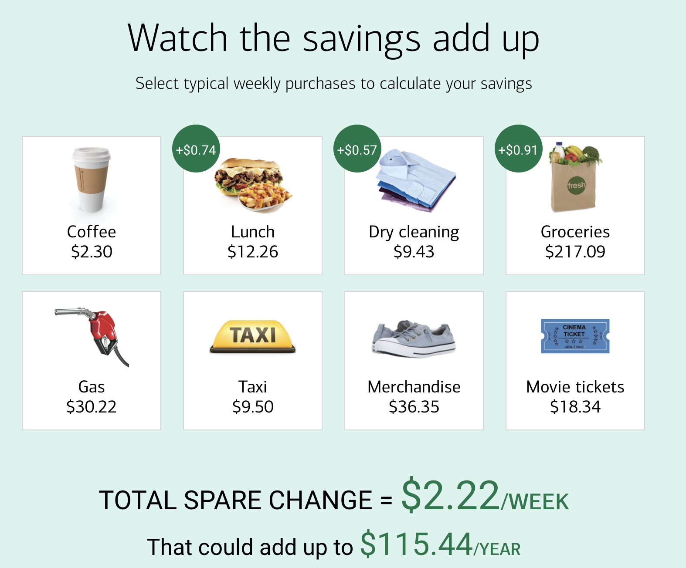

# Lernziele Digital Innovation

* Studierende sollen verstehen, dass digitale Innovationen Kunden-  bzw. Nutzerprobleme lösen müssen, um erfolgreich zu sein
* Studierende sind in der Lage gemeinsam im Team eine innovative Idee zu entwickeln und diese anhand von Nutzerfeedback iterativ weiterentwickeln
* Studierende können vorgegebene Templates einsetzen, um Produkt- und Serviceideen zu entwickeln und zu bewerten (z.B. Value Proposition Canvas und Business Model Canvas)

# Digitale Innovationen sind allgegenwärtig

Die Digitalisierung durchdringt den Alltag der Menschen. Im Privatleben sind dies beispielsweise:

* Smarte Wohnungen und Häuser mit digitalen Assistenten und Automatisierungen von Beleuchtung oder Heizungssteuerung
* Mobile Endgeräte die ständig mit dem Internet verbunden sind und nahtlose Nutzungserlebnisse über Laptops, Smartphones und Tablets hinweg ermöglichen.

Auch im beruflichen Umfeld nimmt Digitalisieerung weiter zu:

* Smarte Produktionsanlagen mit Touch-Displays
* Virtuelle Brillen, die per Augmented Reality zusätzliche Informationen für die Nutzer*innen einblenden
* Fahrzeuge, die zunehmend über autonome Fahrassistenten verfügen und mit anderen Fahrzeugen und Diensten Informationen austauschen.

# Technologie alleine löst keine Probleme

Trotz des digitalen Fortschritts scheitern vielen Innovationen nicht an der technischen Machbarkeit, sondern an der mangelnden Akzeptanz durch die Nutzer*innen. 

Der Barcode-Scanner *CueCat* ermöglichte es Nutzern einen Barcode aus einer gedruckten Zeitschrift (oder Broschüre) einzuspannen, und sich eine Webseite mit weiteren Informationen auf einem an die *CueCat* angeschlossenen Rechner anzeigen zu lassen. Beispielsweise schickte die Zeitschrift *Wired* 500.000 Geräte an ihre Abonnenten. Die Installation der *CueCat* am eigenen Rechner dauerte ca. eine Stunde und erforderte das Ausfüllen eines Fragebogens mit vielen persönlichen Fragen. Um das Gerät nutzen zu können, musste dieses mit dem angeschlossenen Rechner verbunden sein, somit mussten die Nutzer am Rechner sitzen, um eine Zeitung zu lesen. Aus Mangel an Userakzeptanz wurde das Produkt eingestellt und in die Liste der "The 25 Worst Tech Products of All Time" der Zeitschrift PCWorld aufgenommen (vgl. https://en.wikipedia.org/wiki/CueCat). Bei der Entwicklung des Produkts wurde möglicherweise vergessen, dass die Barcodes von Nutzern eingescannt werden müssen, um erfolgreich zu werden.

Die Firma Vorwerk vertreibt seit Jahren erfolgreich das Gerät Thermomix, das es Nutzern erlaubt Gerichte zu kochen, ohne Kochexperten zu sein. Das Produkt Temial soll es Nutzern erleichtern Tee zu kochen. U.a. können Nutzer eine Teesorte einscannen, und das Gerät passt seinen Kochvorgang an. Ursprünglich sollte Temial für € 599,- vertrieben werden, aber im Internet finden sich Hinweise, dass es zuletzt für € 299,- verkauft wurde (vgl. ) und 2022 wieder eingestellt wurde (vgl. https://www.handelsblatt.com/unternehmen/handel-konsumgueter/thermomix-thermomix-beschert-vorwerk-rekordumsatz/). Mutmaßlich war das Nutzerproblem, das der Temial löst nicht groß genug, um eine solche Investition zu rechtfertigen. Das Produkt wurde 2022 wieder eingestellt.

# Überblick über die Phasen Explore - Create - Evaluate

Innovationsentwicklung ist ein iterativer Prozess, bei dem Nutzerbedürfnisse verstanden, Ideen entwickelt und getestet werden. Dark Horse Innovation (2016) definieren dazu die Phasen *Create*, *Explore* und *Evaluate* anhand derer sich Innovationen entwickeln lassen. Mit welcher Phase zum Start des eigenen Projekts begonnen wird, hängt vom Wissen des Teams bzgl. der Innovation ab (vgl. Dark Horse Innovation (2016: 18, 25, 30):

**Explore** - Nutzerbedürfnisse verstehen (Problem und Lösung unbekannt)

* Das Team kennt zwar den Problembereich (z.B. Pflege, Pendeln zur OTH, nachaltiges Einkaufserlebnis) aber noch nicht die Probleme und Bedürfnisse der Nutzer*innen
* Das Team weiß nicht genau, wo es anfangen soll und welche Nutzer*innen die Zielgruppe sind
* Das Team hat das Gefühl, dass eine digitale Innovation in diesem Umfeld möglich ist 

**Create** - Ideen entwickeln (Problem bekannt, Lösung unbekannt)

* Das Team kennt die Nutzer*innen und deren Probleme und Bedürfnisse
* Das Team versteht das Verhalten der Nutzer*innen
* Das Team hat noch keine konkrete Idee zur Lösung des Problems
* Das Team will neue Ideen zu einem bekannten Problem entwickeln

**Evaluate** - Feedback einholen (Problem bekannt, Lösungsidee vorhanden, Erfolg der Idee unbekannt)

* Das Team kennt die Nutzer*innen, deren Verhalten und deren Probleme
* Das Team hat das Nutzerproblem erkannt und kann es beschreiben
* Eine oder mehrere Ideen existieren, aber das Potential der Idee(n) ist unbekannt
* Das Team möchte das Risiko bei der Einführung einer Idee begrenzen

Die folgenden Abschnitte beschreiben die einzelnen Phasen genauer.

# Innovation Case Studies

Die folgenden Case Studies sollen illustrieren, wie Innovation Teams bei der Entwicklung von Innovationen vorgehen können. Die eingesetzte Methodik lässt sich dabei immer den Phasen *Explore*, *Create* und *Evaluate* zuordnen, auch wenn die Teams andere Frameworks für Ihre Vorgehensweise verwendet haben.

## Case Study - Embrace

Ein Team von Studierenden der d.school in Stanford hatte die Aufgabe einen kostengünstigen Inkubator (Brutkasten) für Säuglinge in Entwicklungsländern zu entwickeln. Das Team hätte einer ersten Eingebung folgen können und die Kosten für den Brutkasten durch Reduktion selten gebrauchter Funktionen oder Vereinfachung der mechanischen Konstruktion erreichen können (*Creat*e). Ein Teammitglied aber konnte finanzielle Unterstützung für eine Reise nach Nepal gewinnen, um sich dort die Situation vor Ort anzusehen (*Explore*). Die Überraschung vor Ort war, dass Krankenhäuser zwar über Inkubatoren verfügen, diese aber leer stehen, d.h. nicht genutzt werden. Den Inkubator selbst günstiger zu machen hätte die Überlebenschancen der Säuglinge also nicht verbessert. Bei der weiteren Beobachtung wurden die Gründe für diese Leerstand klar: 

*  Die Babies werden häufig nicht in Krankenhäusern geboren, sondern in Dörfern aus dem Umfeld des Krankenhauses. Die Kinder kämpfen also zuhause um das Überleben.
* Selbst wenn Mütter den Weg in das Krankenhaus mit dem Kind auf sich nehmen, müssen Sie das Krankenhaus mit dem Kind oft schon nach wenigen Tagen wieder verlassen, da sie sich um ihre Familien kümmern müssen; auch wenn für das Kind ein mehrwöchiger Krankenhausaufenthalt angebracht gewesen wäre.

Das Team definierte die Problemstellung gemäß dieser Erkenntnisse neu: "Wie können wir eine kostengünstige Möglichkeit entwickeln, um zu früh geborenen Kindern außerhalb der Krankenhäuser zu helfen?"

Anschließend entwickelte das Team viele Ideen (*Create*) und Prototypen (*Evaluate*) und entwickelte einen tragbares Gerät, um Säuglingen die richtige Temperierung des Körpers zu erleichtern. Der entwickelte *Embrace* ist ein tragbarer Schlafsack, mit einer mit paraffin gefüllten Umhüllung, der die Babies auch ohne Strom wärmen kann:

Im anschließenden Test (*Evaluate*) wurden Fehlbedienungen und deren Gründe identifiziert: Mithilfe eines externen Geräts lässt sich das parafingefüllte Wärmekissen wieder erwärmen. Dazu muss auf dem Gerät die richtige Körpertemperatur angezeigt werden. Als das Team das Gerät testete gaben die Mütter die Rückmeldung, dass westliche Ärzte immer zu viel Medizin verschreiben. Wenn ein Arzt also einen telöffel Medizin verschreibt, dann geben Sie dem Kind nur einen halben Teelöffel, um sicher zu sein nicht zu viel Medizin zu geben. Für den *Embrace* bedeutete das, dass Sie nicht abwarten würden, bis das Kissen auf die Zieltemperatur von 37 Grad erwärmt würde, sondern schon bei einem niedrigeren Wert, z.B. 30 Grad abbrechen würden. Dies hätte fatale Folgen für die Kinder. Das Team nahm diese Erkenntnisse ernst und passte das Gerät so an, dass keine numerische Anzeige mehr erkennbar war, sondern nur der Text "OK", wenn die richtige Temperatur erreicht wurde. Für die Kinder könnte diese Änderung des Produkts den Unterschied zwischen Leben und Tod ausmachen.

Quelle: https://slate.com/human-interest/2013/11/embrace-infant-warmer-creative-confidence-by-tom-and-david-kelley.html

## Case Study Bank of America

Die Bank of America ist eine amerikanische Bank mit Endkundengeschäft, vergleichbar mit deutschen Sparkassen. Die Bank startete ein Innovationsprojekt, mit dem Ziel neue Kunden zu gewinnen. Allerdings waren die Probleme auf Kundenseite unbekannt. Anstatt direkt in die Ideenfindung (*Create*) zu gehen, entschloss sich das Team zuerst die Bedürfnisse der Kund\*innen zu analysieren. Als Zielgruppe wurden junge Mütter identifiziert. In den Interviews wurde deutlich, dass Sparen ein wichtiges emotionales Bedürfnis der Mütter ist, die Bank dies organisatorisch nicht unterstützt. Sollte beispielsweise ein Betrag vom Girokonto gespart werden, muss dieser manuell auf ein Extrakonto, ggf. sogar bei einer anderen Bank überwiesen werden. Ebenso fiel auf, dass viele Mütter ein Haushaltsbuch führen, bei dem sie ihre Ausgaben großzügig aufrundeten, um sicherzustellen, dass sie am Ende des Monats über einen Puffer bzw. Sparbetrag verfügten. Basierend auf diesen Erkenntnissen ging das Team in die Ideenentwicklung (*Create*). In 20 Brainstorming-Sessions wurden 80 Konzepte entwickelt. Die am Ende ausgewählte Idee "Keep the change" rundet automatisch alle Einkäufe auf den nächsten Dollarbetrag auf und überweist diese automatisch auf ein Sparkonto der Bank. Die Idee wurde anschließend visualisiert und mit einer großen Zahl von Nutzer*innen getestet. Das Team iterierte die folgenden Punkte (zurück zu *Create*):

* Anzeige der Summe der aufgerundeten Beträge
* Funktion, die verhindert, das das Konto beim aufrunden ins Minus rutscht
* Werbemaßnahme: In den ersten drei Monaten stockt die Bank of America die gesparten Beträge um 100% auf

Die folgende Abbildung illustriert das Prinzip hinter "Keep the Change" (vgl. https://www.bankofamerica.com/deposits/keep-the-change/):

Der Service "Keep the Change" ist auch wirtschaftlich rentabel für die Bank und steigerte die Zahl der Neukunden deutlich. Das Programm existiert bis heute.

Quelle: https://thisisdesignthinking.net/2018/09/feeling-in-control-bank-of-america-helps-customers-to-keep-the-change/

### Case Study - Dropbox 

Als die Entwickler von Dropbox die Idee hatten einen Clouddienst für das Backup und Teilen von Daten hatten wussten sie nicht, ob der Service bei Nutzern erfolgreich sein würde, d.h. auf einen Bedarf trifft. Anstatt direkt mit der Implementierung zu beginnen, wollten Sie zuerst die Hypothese prüfen (*Evaluate*), ob Nutzer\*innen ein Problem mit der Synchronisierung ihrer Dateien über mehrere Geräte hinweg hatten. Sie begannen damit eine Webseite mit einem Video zu erstellen, in welchem das Konzept von Dropbox erläutert wurde. Nutzer\*innen hatten die Möglichkeit sich auf einer Warteliste für diesen neuen Service zu registrieren. Die Resonanz war so groß, dass die Software anschließend entwickelt wurde. (vgl. https://www.shortform.com/blog/dropbox-mvp-explainer-video/).
