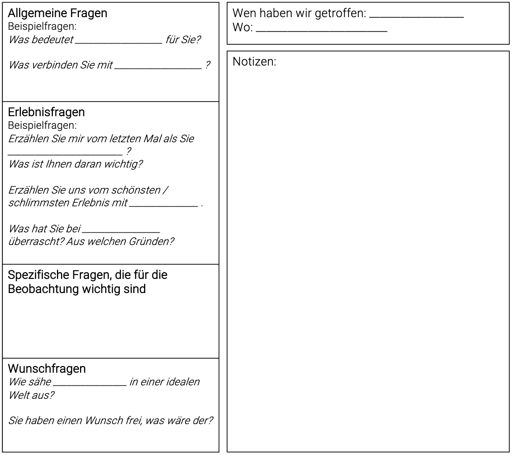
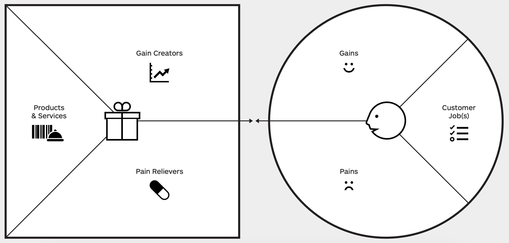
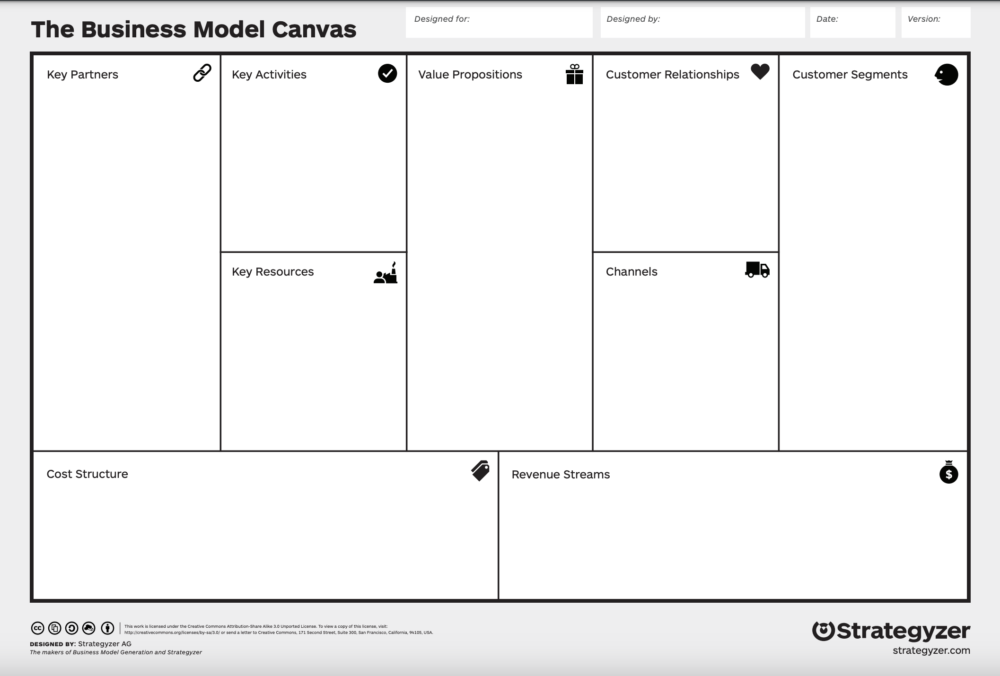
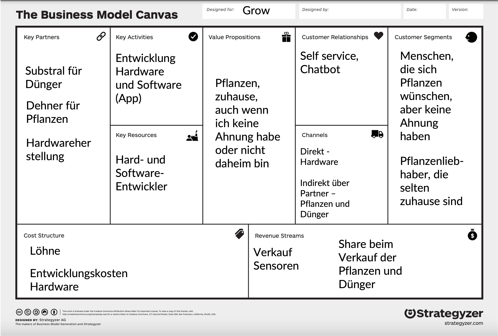

# Digitale Innovationen sind allgegenwärtig

Die Digitalisierung durchdringt den Alltag der Menschen. Im Privatleben sind dies beispielsweise:

* Smarte Wohnungen und Häuser mit digitalen Assistenten und Automatisierungen von Beleuchtung oder Heizungssteuerung
* Mobile Endgeräte die ständig mit dem Internet verbunden sind und nahtlose Nutzungserlebnisse über Laptops, Smartphones und Tablets hinweg ermöglichen.

Auch im beruflichen Umfeld nimmt Digitalisieerung weiter zu:

* Smarte Produktionsanlagen mit Touch-Displays
* Virtuelle Brillen, die per Augmented Reality zusätzliche Informationen für die Nutzer*innen einblenden
* Fahrzeuge, die zunehmend über autonome Fahrassistenten verfügen und mit anderen Fahrzeugen und Diensten Informationen austauschen.

# Technologie alleine löst keine Probleme

Trotz des digitalen Fortschritts scheitern vielen Innovationen nicht an der technischen Machbarkeit, sondern an der mangelnden Akzeptanz durch die Nutzer*innen. 

Der Barcode-Scanner *CueCat* ermöglichte es Nutzern einen Barcode aus einer gedruckten Zeitschrift (oder Broschüre) einzuspannen, und sich eine Webseite mit weiteren Informationen auf einem an die *CueCat* angeschlossenen Rechner anzeigen zu lassen. Beispielsweise schickte die Zeitschrift *Wired* 500.000 Geräte an ihre Abonnenten. Die Installation der *CueCat* am eigenen Rechner dauerte ca. eine Stunde und erforderte das Ausfüllen eines Fragebogens mit vielen persönlichen Fragen. Um das Gerät nutzen zu können, musste dieses mit dem angeschlossenen Rechner verbunden sein, somit mussten die Nutzer am Rechner sitzen, um eine Zeitung zu lesen. Aus Mangel an Userakzeptanz wurde das Produkt eingestellt und in die Liste der "The 25 Worst Tech Products of All Time" der Zeitschrift PCWorld aufgenommen (vgl. https://en.wikipedia.org/wiki/CueCat). Bei der Entwicklung des Produkts wurde möglicherweise vergessen, dass die Barcodes von Nutzern eingescannt werden müssen, um erfolgreich zu werden.

Die Firma Vorwerk vertreibt seit Jahren erfolgreich das Gerät Thermomix, das es Nutzern erlaubt Gerichte zu kochen, ohne Kochexperten zu sein. Das Produkt Temial soll es Nutzern erleichtern Tee zu kochen. U.a. können Nutzer eine Teesorte einscannen, und das Gerät passt seinen Kochvorgang an. Ursprünglich sollte Temial für € 599,- vertrieben werden, aber im Internet finden sich Hinweise, dass es zuletzt für € 299,- verkauft wurde (vgl. ) und 2022 wieder eingestellt wurde (vgl. https://www.handelsblatt.com/unternehmen/handel-konsumgueter/thermomix-thermomix-beschert-vorwerk-rekordumsatz/). Mutmaßlich war das Nutzerproblem, das der Temial löst nicht groß genug, um eine solche Investition zu rechtfertigen. Das Produkt wurde 2022 wieder eingestellt.

# Überblick über die Phasen Explore - Create - Evaluate

Innovationsentwicklung ist ein iterativer Prozess, bei dem Nutzerbedürfnisse verstanden, Ideen entwickelt und getestet werden. Dark Horse Innovation (2016) definieren dazu die Phasen *Create*, *Explore* und *Evaluate* anhand derer sich Innovationen entwickeln lassen. Mit welcher Phase zum Start des eigenen Projekts begonnen wird, hängt vom Wissen des Teams bzgl. der Innovation ab (vgl. Dark Horse Innovation (2016: 18, 25, 30):

**Explore** - Nutzerbedürfnisse verstehen (Problem und Lösung unbekannt)

* Das Team kennt zwar den Problembereich (z.B. Pflege, Pendeln zur OTH, nachaltiges Einkaufserlebnis) aber noch nicht die Probleme und Bedürfnisse der Nutzer*innen
* Das Team weiß nicht genau, wo es anfangen soll und welche Nutzer*innen die Zielgruppe sind
* Das Team hat das Gefühl, dass eine digitale Innovation in diesem Umfeld möglich ist 

**Create** - Ideen entwickeln (Problem bekannt, Lösung unbekannt)

* Das Team kennt die Nutzer*innen und deren Probleme und Bedürfnisse
* Das Team versteht das Verhalten der Nutzer*innen
* Das Team hat noch keine konkrete Idee zur Lösung des Problems
* Das Team will neue Ideen zu einem bekannten Problem entwickeln

**Evaluate** - Feedback einholen (Problem bekannt, Lösungsidee vorhanden, Erfolg der Idee unbekannt)

* Das Team kennt die Nutzer*innen, deren Verhalten und deren Probleme
* Das Team hat das Nutzerproblem erkannt und kann es beschreiben
* Eine oder mehrere Ideen existieren, aber das Potential der Idee(n) ist unbekannt
* Das Team möchte das Risiko bei der Einführung einer Idee begrenzen

Die folgenden Abschnitte beschreiben die einzelnen Phasen genauer.

# Innovation Case Studies

Die folgenden Case Studies sollen illustrieren, wie Innovation Teams bei der Entwicklung von Innovationen vorgehen können. Die eingesetzte Methodik lässt sich dabei immer den Phasen *Explore*, *Create* und *Evaluate* zuordnen, auch wenn die Teams andere Frameworks für Ihre Vorgehensweise verwendet haben.

## Case Study - Embrace

Ein Team von Studierenden der d.school in Stanford hatte die Aufgabe einen kostengünstigen Inkubator (Brutkasten) für Säuglinge in Entwicklungsländern zu entwickeln. Das Team hätte einer ersten Eingebung folgen können und die Kosten für den Brutkasten durch Reduktion selten gebrauchter Funktionen oder Vereinfachung der mechanischen Konstruktion erreichen können (*Creat*e). Ein Teammitglied aber konnte finanzielle Unterstützung für eine Reise nach Nepal gewinnen, um sich dort die Situation vor Ort anzusehen (*Explore*). Die Überraschung vor Ort war, dass Krankenhäuser zwar über Inkubatoren verfügen, diese aber leer stehen, d.h. nicht genutzt werden. Den Inkubator selbst günstiger zu machen hätte die Überlebenschancen der Säuglinge also nicht verbessert. Bei der weiteren Beobachtung wurden die Gründe für diese Leerstand klar: 

*  Die Babies werden häufig nicht in Krankenhäusern geboren, sondern in Dörfern aus dem Umfeld des Krankenhauses. Die Kinder kämpfen also zuhause um das Überleben.
* Selbst wenn Mütter den Weg in das Krankenhaus mit dem Kind auf sich nehmen, müssen Sie das Krankenhaus mit dem Kind oft schon nach wenigen Tagen wieder verlassen, da sie sich um ihre Familien kümmern müssen; auch wenn für das Kind ein mehrwöchiger Krankenhausaufenthalt angebracht gewesen wäre.

Das Team definierte die Problemstellung gemäß dieser Erkenntnisse neu: "Wie können wir eine kostengünstige Möglichkeit entwickeln, um zu früh geborenen Kindern außerhalb der Krankenhäuser zu helfen?"

Anschließend entwickelte das Team viele Ideen (*Create*) und Prototypen (*Evaluate*) und entwickelte einen tragbares Gerät, um Säuglingen die richtige Temperierung des Körpers zu erleichtern. Der entwickelte *Embrace* ist ein tragbarer Schlafsack, mit einer mit paraffin gefüllten Umhüllung, der die Babies auch ohne Strom wärmen kann:

Im anschließenden Test (*Evaluate*) wurden Fehlbedienungen und deren Gründe identifiziert: Mithilfe eines externen Geräts lässt sich das parafingefüllte Wärmekissen wieder erwärmen. Dazu muss auf dem Gerät die richtige Körpertemperatur angezeigt werden. Als das Team das Gerät testete gaben die Mütter die Rückmeldung, dass westliche Ärzte immer zu viel Medizin verschreiben. Wenn ein Arzt also einen telöffel Medizin verschreibt, dann geben Sie dem Kind nur einen halben Teelöffel, um sicher zu sein nicht zu viel Medizin zu geben. Für den *Embrace* bedeutete das, dass Sie nicht abwarten würden, bis das Kissen auf die Zieltemperatur von 37 Grad erwärmt würde, sondern schon bei einem niedrigeren Wert, z.B. 30 Grad abbrechen würden. Dies hätte fatale Folgen für die Kinder. Das Team nahm diese Erkenntnisse ernst und passte das Gerät so an, dass keine numerische Anzeige mehr erkennbar war, sondern nur der Text "OK", wenn die richtige Temperatur erreicht wurde. Für die Kinder könnte diese Änderung des Produkts den Unterschied zwischen Leben und Tod ausmachen.

Quelle: https://slate.com/human-interest/2013/11/embrace-infant-warmer-creative-confidence-by-tom-and-david-kelley.html

## Case Study Bank of America

Die Bank of America ist eine amerikanische Bank mit Endkundengeschäft, vergleichbar mit deutschen Sparkassen. Die Bank startete ein Innovationsprojekt, mit dem Ziel neue Kunden zu gewinnen. Allerdings waren die Probleme auf Kundenseite unbekannt. Anstatt direkt in die Ideenfindung (*Create*) zu gehen, entschloss sich das Team zuerst die Bedürfnisse der Kund\*innen zu analysieren. Als Zielgruppe wurden junge Mütter identifiziert. In den Interviews wurde deutlich, dass Sparen ein wichtiges emotionales Bedürfnis der Mütter ist, die Bank dies organisatorisch nicht unterstützt. Sollte beispielsweise ein Betrag vom Girokonto gespart werden, muss dieser manuell auf ein Extrakonto, ggf. sogar bei einer anderen Bank überwiesen werden. Ebenso fiel auf, dass viele Mütter ein Haushaltsbuch führen, bei dem sie ihre Ausgaben großzügig aufrundeten, um sicherzustellen, dass sie am Ende des Monats über einen Puffer bzw. Sparbetrag verfügten. Basierend auf diesen Erkenntnissen ging das Team in die Ideenentwicklung (*Create*). In 20 Brainstorming-Sessions wurden 80 Konzepte entwickelt. Die am Ende ausgewählte Idee "Keep the change" rundet automatisch alle Einkäufe auf den nächsten Dollarbetrag auf und überweist diese automatisch auf ein Sparkonto der Bank. Die Idee wurde anschließend visualisiert und mit einer großen Zahl von Nutzer*innen getestet. Das Team iterierte die folgenden Punkte (zurück zu *Create*):

* Anzeige der Summe der aufgerundeten Beträge
* Funktion, die verhindert, das das Konto beim aufrunden ins Minus rutscht
* Werbemaßnahme: In den ersten drei Monaten stockt die Bank of America die gesparten Beträge um 100% auf

Die folgende Abbildung illustriert das Prinzip hinter "Keep the Change" (vgl. https://www.bankofamerica.com/deposits/keep-the-change/):

Der Service "Keep the Change" ist auch wirtschaftlich rentabel für die Bank und steigerte die Zahl der Neukunden deutlich. Das Programm existiert bis heute.

Quelle: https://thisisdesignthinking.net/2018/09/feeling-in-control-bank-of-america-helps-customers-to-keep-the-change/

### Case Study - Dropbox 

Als die Entwickler von Dropbox die Idee hatten einen Clouddienst für das Backup und Teilen von Daten hatten wussten sie nicht, ob der Service bei Nutzern erfolgreich sein würde, d.h. auf einen Bedarf trifft. Anstatt direkt mit der Implementierung zu beginnen, wollten Sie zuerst die Hypothese prüfen (*Evaluate*), ob Nutzer\*innen ein Problem mit der Synchronisierung ihrer Dateien über mehrere Geräte hinweg hatten. Sie begannen damit eine Webseite mit einem Video zu erstellen, in welchem das Konzept von Dropbox erläutert wurde. Nutzer\*innen hatten die Möglichkeit sich auf einer Warteliste für diesen neuen Service zu registrieren. Die Resonanz war so groß, dass die Software anschließend entwickelt wurde. (vgl. https://www.shortform.com/blog/dropbox-mvp-explainer-video/).

# Explore im Detail - Nutzerbedürfnisse verstehen

Ohne Kenntnis der Zielgruppe und deren Bedürfnisse ist Innovationsentwicklung ein reines Ratespiel mit einem großen Risiko am Bedarf der Nutzer*innen vorbeizuentwickeln.

**Ziele:**

* Verständnis der Probleme und Bedürfnisse der Zielgruppe
* Strukturierte Dokumentation der Zielgruppe und des Kontexts

Ausgangspunkt für diese Phase ist häufig ein Gefühl, das in einem Bereich eine Innovation möglich ist, ohne jedoch die Nutzer und deren Bedürfnisse genau zu kennen. Diesen Ausgangspunkt formuliert das Team in einer "Design Challenge", die einen Problembereich beschreiben. Beispiele sind wie folgt:

* Re-Design des Erste Hilfe Erlebnisses für Nicht-Profis.
* Re-Design des Einkaufserlebnisses in einem Einkaufszentrums für junge Menschen.
* Re-Design des Bewerbungsprozesses für Berufseinsteiger.
* Re-Design des Kocherlebnisses für Rentner.
* Re-Design des Kocherlebnisses für Studierende.
* Re-Design des Nachrichtenerlebnisses für jüngere Zeitungsleser.
* Re-Design des Umgangs mit personenbezogenen Daten im Netz für Kinder.
* Re-Design des Erlebnisses bei der Einnahme von Medikamenten für ältere Menschen.
* Re-Design das Pflegeerlebnis für ältere Menschen in einem Pflegeheim.

Alle Challenges beinhalten einen Kontext (z.B. Erste Hilfe Erlebnis, Kocherlebnis, Umgang mit personenbezogenen Daten im Netz) und eine potentielle Nutzergruppe (z.B. Nicht-Profis, Berufseinsteiger, jüngere Zeitungsleser)

#### Methode - Desk Research

Das Team recherchiert, was es zu dem Thema der Design-Challenge bereits gibt. Gesucht werden kann nach:

* Bestehenden Produkten und Dienstleistungen
* Forschungsliteratur

### So geht das Team vor:

**Material:** Laptop

**Ablauf**:

1. Team recherchiert in Kleingruppen
2. Kleingruppen stellen sich die Ergebnisse gegenseitig vor
3. Dokumentation der Ergebnisse auf dem *Explore* Canvas

Quelle: https://uxdesign.cc/how-to-use-desk-research-to-kick-start-your-design-process-aab6e67fd7a4

#### Methode - Qualitative Interviews

Ziel qualitiver Interviews ist es Empathie mit Nutzern aufzubauen, und deren Probleme und Bedürfnisse zu verstehen. Diese dienen später als Basis für die Entwicklung der Innovation.

Do's für qualitative Interviews:

* Meister-Schüler-Modell (Interviewer ist der Schüler)
* Eher offene als geschlossene Fragen
* Eher neutrale als suggestive Fragen
* Interviewleitfaden vorbereiten, um sicherzugehen, dass alle relevanten Themen berücksichtigt werden
* Interviews immer mindestens zu zweit durchführen: Eine Person führt das Interview, die andere dokumentiert die Ergebnisse

Die folgende Abbildung zeigt einen Interviewleitfaden:

Interviewpartner antworten zunächst oft oberflächlich, das Team kann eine "Warum?"-Frage stellen, um den tatsächlichen Bedürfnissen der Interviewpartner auf den Grund zu gehen.

Beispielsweise:

* Frage: Beschreiben Sie das letzte Mal, als Sie in der Altstadt einkaufen waren?
* Antwort: Ich gehe nicht in die Altstadt zum Einkaufen.
* Frage: Warum gehen Sie nicht dort einkaufen?
* Antwort: Ich komme nicht dazu?
* Frage: Warum kommen Sie nicht dazu?
* Antwort: Es ist mir einfach zu stressig. Zu viele Leute auf den Straßen und ich brauche ewig bis ich die Geschäfte finde.

Das Team hätte nach der ersten Frage aufhören können, zu fragen. Aber nur durch die Warum-Fragen konnten für das Projekt hilfreiche Erkenntnisse gewonnen werden (Einkaufen wird als stressig wahrgenommen, Suche der Geschäfte wird als schwierig gesehen)

#### Methode - Beobachtung

Das Team versucht als stiller Beobachter, Nutzer und den Kontext zu verstehen. Somit können unbewusste Verhaltensweisen und neue Erkenntnisse identifiziert werden (vgl. Digital Innovation Playbook, S. 136ff).

Typischer Ablauf einer Beobachtung:

1. Vorbereitung
   * Ort der Beobachtung Auswählen
   * Aufteilen in Zweiterteams
   * Notizbuch und Kamera mitnehmen
2. Beobachten
   * Aufmerksame Beobachtung des Verhaltens (z.B. Nutzer in einem Fitnessstudio, ältere Menschen bei der Einnahme von Medikamenten)
   * Notizen und Fotos machen (falls möglich)
3. Gemeinsame Diskussion der Eindrücke im Team nach der Beobachtung
4. Optional: Anschließendes Interview der beobachteten Personen (vgl. Methode - Qualitative Interviews)

Mögliche Dokumentation:

* Was haben wir beobachtet?
* Was haben wir erwartet?
* Was hat uns überrascht?
* Was schließen wir daraus?

#### Methode - How Might We Frage (oder Standpunkt)

Der Standpunkt kondensiert die anfängliche Fragestellung auf ein konkretes Problem einer Nutzergruppe herunter und baut auf den Erkenntnissen des Teams auf.

* Knackig und einprägsam
* Lässt unterschiedliche Lösungsmöglichkeiten zu
* Bezieht sich auf die Bedürfnisse und Erkenntnisse aus der Beobachtungsphase

Dazu kann folgendes Template verwendet werden:

[User] möchte [Bedürfnis] **da** (oder “aber . . .” / “überraschenderweise . . .”) [Insight].

Die How Might we Frage kann eine Kombination der Felder *Needs* und *Insights* sein

Beispiele für einen Standpunkt könnten sein:

* Peter, 24, Student, möchte sich in der WG gesund ernähren, überraschenderweise isst er dort nur ungesunde Fertiggerichte.
* Karl möchte sich gesund ernähren und gerne etwas mit seinen Freunden unternehmen. überraschenderweise fühlt er sich abends in der Bar isoliert, wenn er keinen Drink in der Hand hält.
* Luise möchte jederzeit bereit für Unternehmungen sein, wenn sie aber ihre schwere Geldbörse mitnehmen muss, fühlt sie sich alles andere als bereit.
* Bernhard möchte seine Steuererklärung pünktlich erledigen, überraschenderweise gibt er diese regelmäßig zu spät ab.
* Sophie möchte sich nachhaltig ernähren, aber zuhause trinkt sie jeden morgen zwei Tasse Kaffee aus ihrer Kapselmaschine.
* Emilia geht gerne in die Schule, überraschenderweise verliert sie zuhause jegliche Motivation und quält sich durch ihre Hausaufgaben.
* Justus möchte seine Hausarbeit am CIP-Rechner und bei seinen Eltern zuhause bearbeiten, aber das ewige Herumtragen eines USB-Sticks nervt ihn.
* Kate möchte gerne mehr für sich und ihre Kinder sparen, überraschenderweise ist Sparen für sie mit viel Aufwand verbunden, wenn Sie Geld von ihrem Girokonto auf ein Sparkonto überweisen muss.
* Hubert, 42, Landwirt möchte seine Tiere stets gut versorgen, überraschenderweise tut er sich sehr schwer damit morgens um 5:00 Uhr aus dem Bett zu kommen.

# **Create** - Ideen entwickeln

**Ziele:**

* Entwicklung einer oder mehrerer Ideen, die den Standpunkt aus der Phase *Explore* adressieren
* Dokumentation der Idee als Basis für die Entwicklung eines Prototyps

### Methode - Brainstorming

Im Brainstorming geht es darum möglichst viele Ideen zu generieren und diese anschließend zu bewerten. Das Team kann eine Idee in die Phase *Evaluate* übernehmen.

Beim Brainstorming beginnt das Team mit "divergierendem" Denken, bei dem viele Optionen entwickelt werden, in der anschließenden Phase des "konvergierenden Denkens" werden die Ideen verdichtet und kategorisiert (vgl. die folgende Abbildung - https://www.ideou.com/pages/brainstorming)

**Material:** Whiteboard, PostIts, Klebepunkte

**Ablauf**:

1. Team sieht sich gemeinsam die How-Might-We Frage an (falls vorhanden)
2. Silent Brainstorming (5min) - Jeder schreibt seine / ihre Ideen auf PostIts (eine Idee pro PostIt) - So viele Ideen wie möglich generieren (divergierendes Denken)
3. Die Ideen werden nacheinander im Team durch Kleben auf ein Whiteboard geteilt - Dabei können jederzeit neue Ideen eingeworfen und auf PostIts am Whiteboard ergänzt werden
4. Anschließend wählt jeder eine Idee, die nicht von ihm / ihr ist und entwickelt dazu drei neue Ideen
5. Ideen werden geclustert (konvergierendes Denken)
6. Das Team diskutiert die Ideen und wählt eine Idee aus, die es in der Phase **Evaluate** weiterverfolgen will. Ist die Auswahl der Idee unklar, können unterstützend Klebepunkte verwendet werden. Dazu erhält jeder drei Klebepunkte (blau: zukunftsorientierte Idee, rot: Nutzer werden diese Idee super finden, grün: Quick Win, d.h. einfach umzusetzen) - Häufig fällt die Ideenauswahl danach leichter.

Brainstorming Regeln:

* Kritik zurückstellen (erstmal zähle jede Idee)
* Wilde Ideen ermutigen - Auch verrückte Ideen können sich nach längerer Diskussion als sinnvolle Lösungen erweisen. z.B. kann die Idee eines Hundes, der Menschen durch das Holen von Einkäufen aus dem Supermarktregal unterstützen kann auf den ersten Blick nur verrückt klingen - Denkt man den Hund aber als Roboter, liegt diese Form der Einkaufsunterstützung schon etwas näher.
* Quantität ist wichtig - Erst viele Ideen entwickeln, die Auswahl kommt später
* Auf den Ideen anderer aufbauen - Innovationsentwicklung ist ein Teamprozess, der von vielen verschiedenen Sichtweisen profitiert, keine One-Man-Show.
* Visuell arbeiten - Visualisierte Ideen (auf einem PostIt) werden häufig besser verstanden und sind aussagekräftiger als reiner Text

Weitere Informationen zu Brainstorming online: https://www.ideou.com/pages/brainstorming

### Methode - Value Proposition Canvas

Mithilfe des Value Proposition Canvas lassen sich die folgenden Punkte konkretisieren:

* Aus Nutzersicht aufzeigen welche Probleme die Lösung für die Nutzer*innen lösen soll und was diese zu gewinnen, bzw. zu verlieren haben (rechte Seite der folgenden Abbildung)
  * Gains - Was können die Nutzer gewinnen? Was wollen sie wirklich (erreichen)?
  * Pains - Was läuft aktuell für die Nutzer nicht gut? Was sind die größten Frustrationen?
  * Customer Jobs - Jobs sind Gründe aus denen Nutzer ein Produkt oder einen Dienst nutzen. Diese helfen es die Nutzerperspektive einzunehmen, um die Chance zu erhöhen, das die entwickelte Lösung zu den Nutzerbedürfnissen passt. Für den Standpunkt "Sophie möchte sich nachhaltig ernähren, aber zuhause trinkt sie jeden morgen zwei Tassen Kaffee aus ihrer Kapselmaschine." könnten diese sein:
    * Möchte wenig Müll erzeugen
    * Möchte beitragen, den Planeten zu retten
    * Möchte Anerkennung von ihren Freundinnen
    * Will sich nicht für ihre Kapselmaschine schämen
    * Möchte in der früh wach werden und energiereich in den Tag starten
    * Will guten und frischen Kaffee trinken
* Beschreibung der entwickelten idee, und wie diese die Probleme der Nutzer lösen soll (linke Seite der folgenden Abbildung)
  * Products & Services - Was ist die Lösung?
  * Gain Creators - Wie kann die Lösung den Nutzer*innen helfen?
  * Pain Relievers - Wie kann die Lösung die "Pains" der Nutzer*innen adressieren?

Der Value Proposition Canvas beschreibt somit die Idee (z.B. aus dem Brainstorming) genauer und stellt den Bezug zwischen Idee und Nutzer*innen her.

### So geht das Team vor:

**Material:** Whiteboard, PostIts, Template Value Proposition Canvas

**Ablauf**:

1. Team bereitet Whiteboard und Material vor

2. Team brainstormt für die rechte Seite des Value Proposition Canvas

3. Team brainstormt für die linke Seite des Value Proposition Canvas

4. Team dokumentiert Ergebnisse auf dem Value Proposition Canvas

Weitere Informationen hier: https://www.strategyzer.com/canvas/value-proposition-canvas

# **Evaluate** - Feedback einholen

**Ziele:**

* Ideen des Teams konkretisieren und greifbar machen ("Denken mit den Händen")
* Ziel ist die Entwicklung eines groben Modells, das die Innovation des Teams für Nutzer erlebbar macht (Prototypen dürfen sich iterativ weiterentwickeln, sind zu Beginn eines Projekts grob, werden dann aber schrittweise verfeinert)
* Testen des entwickelten Prototyps mit Nutzern
* Getestet werden soll die dem Prototyp zugrundeliegende Hypothese bzw. die dem Prototyp zugrundeliegenden Prinzipien (d.h. den Kern der Idee testen)
* Die Erkenntnisse aus dem Testing können wieder in weiteren Iterationen des Prototyps integriert werden oder das Team in ein andere Phase (*Create*, oder *Evaluate*) führen
* Testen ähnelt der Beobachtung, der Prototyp ist ein Artefakt zur Kommunikation, um mehr über die Nutzer und deren Bedürfnisse zu erfahren

### Methode - Testen

Hier wird die der Idee zugrundeliegende Hypothese getestet. D.h. es soll herausgefunden werden, ob der Kern der Idee die Probleme der Nutzer*innen adressiert. Neben der Validierung der Idee ist Testen eine Möglichkeit, um mehr über die Bedürfnisse und Probleme der Zielgruppe zu erfahren.

### Methode - Business Model Canvas

Das Geschäftsmodell (Business Model) einer Idee / eines Startups / eines Unternehmens beschreibt, welche Ressourcen für die Entwicklung eines (digitalen) Produkts / einer Dienstleistung aufgebracht werden müssen, und wie diese an die Kunden gebracht werden soll.

Die folgende Abbildung zeigt einen Business-Model Canvas (Quelle: https://www.strategyzer.com/bmc_thank_you)

Das Team möchte die digitale Innovation "Grow" entwickeln, die es Personen mit wenig Kenntnissen über Pflanzen, und Personen, die selten zuhause sind erlaubt, Pflanzen zu haben und zu pflegen. Dazu wird zunächst ein Sensor am gewünschten Ort für die Pflanze aufgestellt und ermittelt, welche Pflanzen für den Ort geeignet sind. Über eine App lassen sich die empfohlenen Pflanzen direkt bestellen. Sobald die Pflanze aufgestellt ist, wir der Sensor in die Erde gesteckt und bewässert und düngt die Pflanze automatisch. Ein ausgefüllter Business Model Canvas könnte wie folgt aussehen:

Mithilfe des Canvas hat sich das Team klargemacht, dass sie die Hardware nicht selbst herstellen wollen, und auch den Dünger und die Pflanzen nicht selbst vertreiben wollen. Lediglich der Sensor soll selbst entwickelt und vertrieben werden.

### So geht das Team vor:

**Material:** Whiteboard, PostIts, Template Business Model Canvas

**Ablauf**:

1. Team bereitet Whiteboard und Material vor

2. Team brainstormt gemeinsam die Felder des Business Model Canvas

# Iteration

Auch wenn die Phasen *Explore*, *Create*  und *Evaluate* hier in einer definierten Reihenfolge vorgestellt werden, ist Innovation ein iterativer Prozess. Jedes Team durchläuft alle Phasen mehrfach und passt die Ergebnisse der Phasen kontinuierlich an.

# Quellen:

Dark Horse Innovation. (2016). Digital Innovation Playbook. Hamburg: Murmann Publishers GmbH.

Ideen:

* Templates zum Download bereitstellen und auch Drucken - Somit Studierende ins Lab bringen